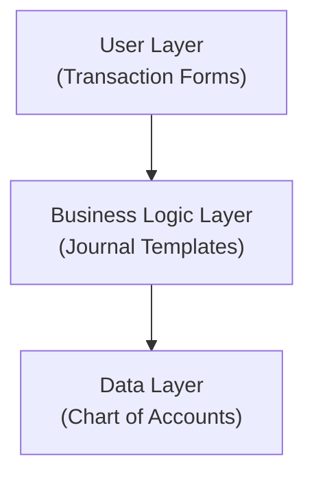

# Aplikasi Akunting

Web-based accounting application designed specifically for Indonesian small businesses, freelancers, and online sellers.

## Overview

A modern accounting system that combines ease-of-use with comprehensive Indonesian tax compliance. Built on a transaction-centric architecture that shields users from complex accounting concepts while maintaining proper double-entry bookkeeping behind the scenes.

## Target Market

### Primary Users
- **IT Services & Consulting** - Software development, corporate training, IT consulting
- **Wedding Photography/Videography** - Freelance photographers, small studios
- **Home-based Online Sellers** - Marketplace sellers (Tokopedia, Shopee, Bukalapak), social media commerce

### User Characteristics
- Minimal accounting/finance/tax knowledge
- May employ junior accounting staff (fresh graduates)
- One bookkeeper may serve multiple clients
- 100% Indonesian users

## Key Features

### 🧾 Transaction-Centric Design
- Simple transaction forms instead of complex journal entries
- Pre-configured templates for common business scenarios
- No accounting jargon - business language throughout
- Automatic generation of proper double-entry bookkeeping

### 💰 Indonesian Tax Compliance
- **PPN (VAT):** Automatic calculation, SPT Masa PPN generation
- **PPh:** Support for PPh 21, 23, 4(2), 25, 29
- **e-Faktur & e-Bupot** integration (future)
- Tax calendar with automated reminders
- PKP vs non-PKP handling

### 📊 Project-Based Accounting
- Tag transactions by project/job/event
- Track project profitability
- Milestone billing support
- Client deposits and progress payments

### 📦 Simple Inventory Tracking
- Buy/sell model (no manufacturing complexity)
- Stock quantity tracking
- COGS calculation (FIFO or Average)
- Multi-channel sales tracking (per marketplace/platform)

### 📄 Document Management
- Attach receipts, invoices, contracts to transactions
- Cloud storage with 10-year retention (Indonesian tax requirement)
- OCR support for scanned documents
- Complete audit trail

### 👥 User Management
- Role-based access: Owner, Operator, Power Operator, Viewer, Auditor
- Time-bound auditor access
- Multiple users per company instance
- User activity audit trail

### 📈 Analysis & Reporting
- Laporan Laba Rugi, Neraca, Arus Kas
- Project profitability reports
- Channel performance analysis (for online sellers)
- Budget vs actual comparison
- Export to PDF, Excel, CSV

## Architecture Highlights

### Three-Layer Design

### Journal Template System
- Pre-configured templates for Indonesian business scenarios
- User-customizable templates for power users
- Handles simple to complex entries (one-to-many, many-to-many)
- Automatic tax calculations

### Single-Tenant Architecture
- Instance-per-client deployment (one app per company)
- Complete data and process isolation
- No multi-tenancy code complexity
- **Deployment Progression:**
  - Phase 1: Single company (manual deployment)
  - Phase 2: Multi-instance single node (control plane for client management)
  - Phase 3: Node per client (Pulumi automation for dedicated VPS)

## Documentation

Comprehensive documentation is available in the `/docs` directory:

- **[Requirements & Features](docs/01-requirements.md)** - Detailed feature specifications and target market
- **[Architecture](docs/02-architecture.md)** - System architecture and design principles
- **[Data Model](docs/03-data-model.md)** - Complete database schema and entity relationships
- **[Tax Compliance](docs/04-tax-compliance.md)** - Indonesian tax handling and regulations
- **[Technology Stack](docs/05-technology-stack.md)** - Technology selection and justification
- **[Decisions & Questions](docs/99-decisions-and-questions.md)** - Design decisions, open questions, and research items

## Competitive Differentiators

1. **Tax Automation** - Automatic Indonesian tax calculations from transactions
2. **Junior-Friendly** - Guided workflows, no accounting knowledge required
3. **Simple Deployment** - Instance-per-client architecture for data isolation
4. **Project-Based Accounting** - Built-in job costing for service businesses
5. **Multi-Channel Support** - Marketplace and social media sales tracking
6. **Analysis Focus** - Actionable business insights, not just compliance
7. **Indonesian-Native** - Built specifically for Indonesian regulations

## Technology Stack

### Core Stack

**Runtime:**
- Java 25 (LTS with virtual threads)

**Backend:**
- Spring Boot 4.0
- Spring Data JPA
- Spring Security
- Thymeleaf (template engine)

**Frontend Enhancement:**
- HTMX (partial page updates)
- Alpine.js (lightweight interactivity)
- Tailwind CSS or Bootstrap

**Database:**
- PostgreSQL 17

**Document Storage:**
- Phase 1: MinIO (self-hosted, S3-compatible)
- Phase 2+: Indonesian cloud (Biznet Gio, IDCloudHost) or AWS S3/GCS

### Development & Testing

**Local Development:**
- Docker Compose (multi-container orchestration)

**Infrastructure:**
- Current: Docker Compose + manual provisioning
- Future: Pulumi (programmatic VPS provisioning for SaaS)

**Testing:**
- JUnit 5 + Mockito (unit tests)
- Testcontainers (integration tests)
- Playwright (functional/E2E tests)
- K6 (performance testing)

**DevSecOps:**
- SonarQube (SAST)
- OWASP Dependency-Check (dependency vulnerabilities)
- OWASP ZAP (DAST)
- Trivy (container security)
- GitLeaks (secret scanning)

### Architecture: Modern Monolith

**Why not split Backend/Frontend?**
- Single codebase reduces complexity
- No data model or validation duplication
- Simple session-based authentication
- Faster development for accounting workflows
- HTMX provides modern UX without SPA overhead

See [Technology Stack Documentation](docs/05-technology-stack.md) for detailed justification and DevSecOps pipeline.

## Project Status

🚧 **Planning Phase** - Currently in design and documentation stage.

### Completed:
- ✅ Requirements analysis
- ✅ Architecture design
- ✅ Database schema design
- ✅ Tax compliance research outline
- ✅ Technology stack selection

### Next Steps:
1. Finalize open design questions
2. Set up development environment
3. Build proof of concept for journal template system
4. Design UI/UX mockups
5. Implement authentication and multi-tenancy

## Contributing

This is currently a private project. Contributions are not being accepted at this time.

## License

[GNU Affero General Public License v3.0 (AGPL-3.0)](LICENSE)

This project is licensed under AGPL-3.0 to ensure that any modifications made to the software, including when offered as a service (SaaS), must be made available under the same license terms.

## Contact

For inquiries, please contact the project maintainer.

---

**Note:** This project is in active development. Features and documentation are subject to change.
