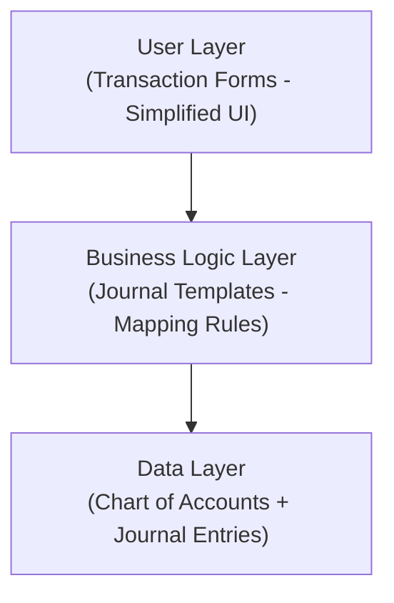
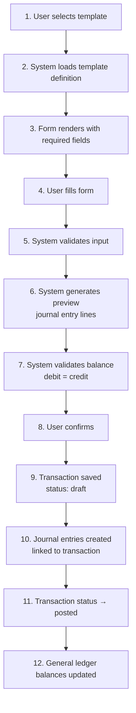
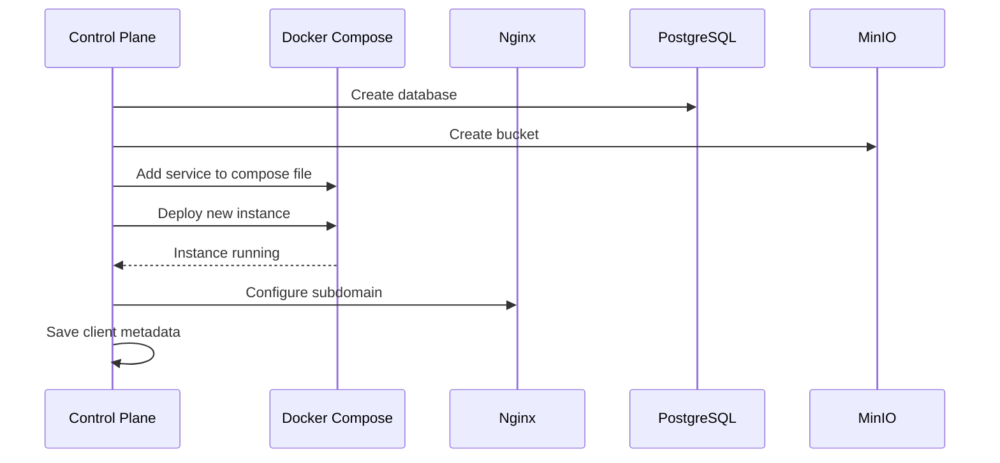
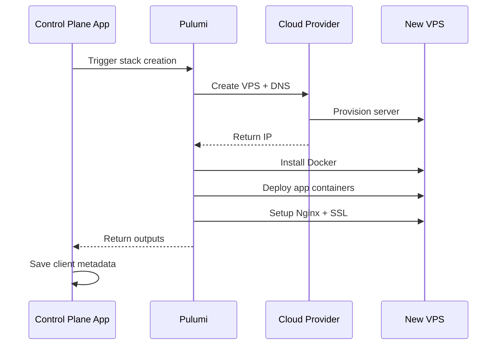

# System Architecture

## Core Design Principle: Transaction-Centric

### Traditional Account-Centric Approach (What We're NOT Doing)

In traditional accounting software, users must understand debits/credits:

**Example: Paying electricity bill Rp 1,000,000**
```
User must know:
Debit:  Beban Listrik (Electricity Expense)     Rp 1,000,000
Credit: Kas/Bank (Cash/Bank)                    Rp 1,000,000
```

**Problems:**
- Requires understanding which accounts to debit/credit
- Must remember debit = expense increase, credit = cash decrease
- Easy to get backwards
- Intimidating for beginners

### Our Transaction-Centric Approach

Users describe business events; system handles accounting.

**Same example: Paying electricity bill**

User fills simple form:
```
Transaction Type: Expense Payment
Date: 2025-01-15
Description: Electricity bill
Category: Utilities - Electricity
Amount: Rp 1,000,000
Paid from: BCA Checking Account
```

System automatically generates proper journal entries:
```
Debit:  Beban Listrik        Rp 1,000,000
Credit: Bank BCA             Rp 1,000,000
```

### More Examples

**Receive customer payment:**
- Form: "Receive Payment"
- Fields: Customer name, Invoice #, Amount, Bank account
- User never sees "Debit Bank, Credit Piutang"

**Purchase inventory:**
- Form: "Purchase"
- Fields: Supplier, Items, Quantity, Price, Payment method
- System handles: Debit Inventory, Credit Bank (or Hutang if unpaid)

**Owner withdrawal:**
- Form: "Owner Withdrawal"
- Fields: Amount, Date, Bank account
- System: Debit Prive/Modal, Credit Bank

## Three-Layer Architecture



### Layer 1: User Layer (Transaction Forms)

**Purpose:** Present business-friendly interfaces

**Characteristics:**
- Simple forms for common business scenarios
- No accounting jargon
- Validation and guidance
- Preview of what will be recorded

**Example Forms:**
- Terima Pembayaran dari Customer
- Bayar Supplier
- Bayar Gaji Karyawan
- Bayar Beban Operasional
- Catat Penjualan
- Tarik Tunai untuk Pribadi

### Layer 2: Business Logic Layer (Journal Templates)

**Purpose:** Translate business transactions into accounting entries

**Key Features:**
- Pre-configured templates for common scenarios
- User-customizable templates for power users
- Mapping rules: transaction fields → accounting accounts
- Amount calculation logic (percentages, formulas)
- Support for simple to complex entries

**Template Types:**

1. **System Templates** (preloaded, available to all tenants)
   - Common business transactions
   - Indonesian tax scenarios
   - Industry-specific templates

2. **Custom Templates** (created by power users)
   - Business-specific workflows
   - Complex multi-line entries
   - Exotic accounting scenarios

**Template Capabilities:**
- Fixed accounts (e.g., PPN Masukan always goes to account 1-1400)
- User-selectable accounts (e.g., which expense category)
- Calculated amounts (e.g., PPN = 11% of base amount)
- Multiple debit/credit lines (one-to-many, many-to-one, many-to-many)

### Layer 3: Data Layer (Chart of Accounts)

**Purpose:** Maintain proper double-entry bookkeeping

**Characteristics:**
- Standard chart of accounts structure
- Industry-specific templates
- Hierarchical account organization
- Full audit trail
- Immutable journal entries (soft delete only)

## Journal Template System

### How Templates Work

**Template Definition:**
```
Template: "Bayar Beban + PPN Masukan"

Lines:
1. Debit  | User selects account    | 100% of transaction amount  | Label: "Akun Beban"
2. Debit  | Fixed: PPN Masukan      | 11% of transaction amount   | Auto
3. Credit | User selects account    | 111% of transaction amount  | Label: "Dibayar dari"
```

**User Experience:**
```
Form displays:
- Jumlah (DPP): Rp 1,000,000
- Kategori Beban: [dropdown - user selects]
- Dibayar dari: [dropdown - user selects]

Preview shows:
Debit:  Beban Sewa Kantor    Rp 1,000,000
Debit:  PPN Masukan          Rp   110,000
Credit: Bank BCA             Rp 1,110,000
                             ============
Total:                       Rp         0  ✓ Balanced
```

**Posted Journal Entries:**
```
Date: 2025-01-15
Reference: TRX-00123

Account              Debit         Credit
5-2100 Beban Sewa    1,000,000     -
1-1400 PPN Masukan     110,000     -
1-1200 Bank BCA        -           1,110,000
                     ===========   ===========
                     1,110,000     1,110,000  ✓
```

### Template Examples

#### Simple Template: Cash Sale
```
Lines:
1. Debit  | User: "Bank Account"        | 100%
2. Credit | User: "Revenue Account"     | 100%
```

#### Medium Complexity: Expense with Tax
```
Lines:
1. Debit  | User: "Expense Account"     | 100%
2. Debit  | Fixed: "PPN Masukan"        | 11%
3. Credit | User: "Payment Account"     | 111%
```

#### Complex: Payment with Discount
```
Lines:
1. Debit  | Fixed: "Hutang Usaha"       | invoice_amount
2. Credit | User: "Bank Account"        | payment_amount
3. Credit | User: "Discount Account"    | discount_amount
```

#### Power User: Multi-Split Allocation
```
Lines:
1. Debit  | User: "Cabang A Expense"    | user_defined
2. Debit  | User: "Cabang B Expense"    | user_defined
3. Debit  | User: "Cabang C Expense"    | user_defined
4. Credit | User: "Payment Account"     | sum_of_debits
```

## User Personas & Capabilities

### Common User (Business Owner / Junior Bookkeeper)
**Capabilities:**
- Select from pre-configured templates
- Fill simple forms
- No need to understand debits/credits
- Can preview journal entries before posting

**Workflow:**
1. New Transaction → Select Template
2. Fill form fields
3. Review preview (optional)
4. Post

### Power User (Accountant / Senior Bookkeeper)
**Capabilities:**
- All common user capabilities
- Create custom journal templates
- Manual journal entry (direct debit/credit)
- Edit chart of accounts
- View/edit underlying journal entries

**Workflow:**
1. Access "Journal Templates" menu
2. Create/edit templates:
   - Define debit/credit lines
   - Set fixed vs user-selectable accounts
   - Configure amount calculations
3. Use custom templates in transactions
4. Or bypass templates with manual journal entry

## Deployment Architecture: Single-Tenant Instances

### Design Philosophy

**Instance-per-Client Approach:**
- Each company gets its own application instance
- Each instance connects to its own database
- Complete isolation at process and data level
- No multi-tenancy code complexity

### Why Single-Tenant?

**Codebase Simplicity:**
- No `tenant_id` in every query
- No tenant context management
- No risk of cross-tenant data leaks
- Cleaner, more maintainable code

**Security Benefits:**
- Complete process isolation
- Separate databases per company
- No shared resources
- Easier compliance for accounting data

**Operational Flexibility:**
- Can co-locate multiple instances on shared VPS (cost-effective)
- Can isolate high-value clients on dedicated VPS (premium)
- Independent updates per client
- Restart/debug single client without affecting others

### Deployment Options

**Option 1: Co-located Instances (Cost-Optimized)**
```
Shared VPS ($12-24/mo)
├── PostgreSQL Service
│   ├── database: company_a
│   ├── database: company_b
│   └── database: company_c
├── MinIO (shared object storage with separate buckets)
├── Spring Boot Instance 1 (Company A) - Port 8081
├── Spring Boot Instance 2 (Company B) - Port 8082
└── Spring Boot Instance 3 (Company C) - Port 8083
```

**Option 2: Dedicated Instance (Premium)**
```
Dedicated VPS ($24+/mo)
├── PostgreSQL (single database)
├── MinIO (dedicated storage)
└── Spring Boot Instance (single client)
```

### No Multi-Tenancy Tables

**Simple database schema without tenant_id:**
```sql
-- No tenant_id needed
transactions
- id                    UUID PRIMARY KEY
- transaction_date      DATE NOT NULL
- description           TEXT NOT NULL
- total_amount          DECIMAL(15,2) NOT NULL

chart_of_accounts
- id                    UUID PRIMARY KEY
- code                  VARCHAR(20) NOT NULL
- name                  VARCHAR(255) NOT NULL
- account_type          VARCHAR(20) NOT NULL

-- Clean queries, no tenant filtering
SELECT * FROM transactions WHERE transaction_date >= '2025-01-01';
```

### User Roles (Per Instance)

**Note:** Each instance is single-company, so roles are simpler:

1. **Owner** (business owner)
   - Full administrative access
   - User management
   - Subscription/billing access

2. **Bookkeeper** (day-to-day operations)
   - Create/edit transactions
   - Generate reports
   - Cannot modify chart of accounts
   - Cannot delete posted transactions

3. **Accountant** (senior staff)
   - All bookkeeper capabilities
   - Modify chart of accounts
   - Create custom journal templates
   - Manual journal entries
   - Period closing

4. **Viewer** (read-only)
   - View all reports
   - Export data
   - No data entry

5. **Auditor** (temporary access)
   - Read-only access to all data
   - View complete audit trail
   - Download documents
   - Time-bound access
   - No modifications allowed

## Data Flow

### Transaction Entry → Journal Posting



### Template Resolution Logic

```python
def generate_journal_entries(transaction, template):
    entries = []

    for line in template.lines:
        entry = {}

        # Resolve account
        if line.account_id:
            # Fixed account in template
            entry.account = line.account_id
        else:
            # User-selected account from transaction
            entry.account = transaction.mappings[line.mapping_key]

        # Calculate amount
        if line.amount_source == 'transaction_amount':
            entry.amount = transaction.amount * line.amount_value / 100
        elif line.amount_source == 'fixed':
            entry.amount = line.amount_value
        elif line.amount_source == 'formula':
            entry.amount = eval_formula(line.formula, transaction)

        # Set debit/credit
        entry.debit = entry.amount if line.line_type == 'debit' else 0
        entry.credit = entry.amount if line.line_type == 'credit' else 0

        entries.append(entry)

    # Validate balance
    assert sum(e.debit for e in entries) == sum(e.credit for e in entries)

    return entries
```

## Deployment Progression

### Phase 1: Single Company (Manual - Current)

**Target:** Own company only, product validation

**Infrastructure:**
- One VPS (2GB RAM, 1 vCPU, ~$12/mo)
- Single application instance
- Single database
- Docker Compose orchestration

**Deployment Process:**
1. Provision VPS manually (DigitalOcean, AWS, etc.)
2. Install Docker and Docker Compose
3. Configure environment variables
4. Deploy: `docker-compose up -d`
5. Access via domain/IP

**Characteristics:**
- No provisioning automation
- No control plane needed
- Manual configuration
- Focus: Get core features rock solid

**When to move to Phase 2:** Product is stable, have 3-5 paying customers

---

### Phase 2: Multi-Instance Single Node (Semi-Automated)

**Target:** 5-50 clients, cost-optimized SaaS

**Infrastructure:**
- Shared VPS (8-16GB RAM, 4-8 vCPU, ~$48-96/mo)
- Multiple application instances (one per client)
- Shared PostgreSQL service (separate databases per client)
- Shared MinIO (separate buckets per client)
- Nginx reverse proxy (subdomain per client)

**Architecture:**
```
VPS ($48-96/mo, 8-16GB RAM)
├── PostgreSQL Service
│   ├── db_company_a
│   ├── db_company_b
│   ├── db_company_c
│   └── ...
├── MinIO
│   ├── bucket-company-a/
│   ├── bucket-company-b/
│   └── ...
├── Application Instances
│   ├── app-company-a (Port 8081)
│   ├── app-company-b (Port 8082)
│   ├── app-company-c (Port 8083)
│   └── ...
└── Nginx Reverse Proxy
    ├── company-a.akuntingapp.com → 8081
    ├── company-b.akuntingapp.com → 8082
    └── company-c.akuntingapp.com → 8083
```

**Control Plane Application:**

*Purpose:* Automate client lifecycle, no infrastructure provisioning yet

*Features:*
- Client onboarding wizard
- Subscription and billing management
- Automated application deployment (Docker Compose)
- Subdomain and Nginx configuration
- Monitoring dashboard
- Support ticketing
- Usage analytics

*Deployment Flow:*


**Control Plane Database:**
```sql
clients
- id, company_name, slug, status
- database_name, bucket_name
- subdomain, port
- created_at, trial_end_date

subscriptions
- id, client_id, plan_id, status
- billing_cycle, amount, next_billing_date

deployments
- id, client_id, version, status
- deployed_at, deployed_by
```

**Characteristics:**
- Infrastructure still manual (single VPS)
- Application deployment automated
- Control plane manages client lifecycle
- Cost-effective (clients share VPS)
- Limited scaling (VPS capacity bound)

**Limitations:**
- All clients on one node (single point of failure)
- Limited to VPS capacity (~10-20 clients per node)
- Resource contention risk
- Manual VPS scaling (upgrade or add nodes)

**When to move to Phase 3:**
- Approaching VPS capacity
- Premium clients need isolation
- Geographic distribution needed

---

### Phase 3: Node Per Client (Fully Automated)

**Target:** 50+ clients, premium tier, geographic distribution

**Infrastructure:**
- Dedicated VPS per client (or multiple clients on premium nodes)
- Automated VPS provisioning via Pulumi
- Geographic distribution (Singapore, Jakarta, etc.)
- Client-specific resource sizing

**Architecture:**
```
Control Plane (admin.akuntingapp.com)
├── Manages all client nodes
├── Pulumi automation for VPS creation
└── Monitoring and billing

Client Nodes (provisioned on-demand)
├── Node 1 (Singapore)
│   ├── Client A (dedicated)
│   └── Client B (dedicated)
├── Node 2 (Jakarta)
│   ├── Client C (dedicated)
│   └── Client D (dedicated)
└── Node 3 (Shared - economy tier)
    ├── Client E
    ├── Client F
    └── Client G
```

**Infrastructure as Code: Pulumi**

*Why Pulumi:*
- Programmatic VPS creation (DigitalOcean, AWS, GCP APIs)
- Real programming language (TypeScript, Python, Java)
- Type-safe infrastructure code
- Built-in state management
- Can be called from Java control plane via Automation API
- Better for creating resources than Ansible

**Provisioning Flow:**


**Pulumi Stack Example:**
```typescript
// Programmatic VPS creation
const droplet = new digitalocean.Droplet(`client-${slug}`, {
    image: "ubuntu-22-04-x64",
    region: "sgp1",
    size: "s-1vcpu-2gb",  // $12/mo
});

// Configure DNS
const dns = new digitalocean.DnsRecord(`${slug}-dns`, {
    domain: "akuntingapp.com",
    type: "A",
    name: slug,
    value: droplet.ipv4Address,
});

// Deploy via SSH
const deploy = new command.remote.Command("deploy", {
    connection: { host: droplet.ipv4Address },
    create: `docker-compose up -d`,
});
```

**Control Plane Database (Extended):**
```sql
-- Metadata for all clients
clients
- id, company_name, slug, status
- deployment_type (shared/dedicated)
- node_id (references vps_servers)
- database_name, subdomain
- created_at, trial_end_date

vps_servers
- id, provider, ip_address, region
- spec (cpu, ram, disk)
- deployment_type (shared/dedicated)
- current_clients, max_clients
- monthly_cost, status

subscriptions
- id, client_id, plan_id, status
- billing_cycle, amount, next_billing_date

deployments
- id, client_id, version, status
- pulumi_stack_name, node_id
- deployed_at, deployed_by
```

**Characteristics:**
- Full infrastructure automation (VPS creation to app deployment)
- Control plane uses Pulumi Automation API
- Mix of dedicated and shared nodes
- Geographic distribution support
- Client-specific resource sizing
- On-demand provisioning

**Pricing Tiers:**
- **Economy:** Shared node (co-located with others)
- **Business:** Dedicated node (2-4GB RAM)
- **Premium:** Dedicated node (8GB+ RAM, enhanced support)
- **Enterprise:** Dedicated cluster (multi-region)

**Benefits:**
- True isolation for premium clients
- No resource contention
- Independent scaling per client
- Geographic optimization (latency)
- Custom resource allocation
- Better SLA guarantees

**Limitations:**
- Higher operational complexity
- More expensive per client
- Pulumi state management needed
- Control plane becomes mission-critical

---

## Deployment Progression Summary

| Aspect | Phase 1 | Phase 2 | Phase 3 |
|--------|---------|---------|---------|
| **Target** | Own company | 5-50 clients | 50+ clients |
| **Infrastructure** | 1 VPS | 1-2 shared VPS | Multiple nodes |
| **Automation** | None | App deployment | Full (infra + app) |
| **Control Plane** | Not needed | Client management | + Pulumi automation |
| **Cost/Client** | N/A | $2-5/mo | $12-50/mo |
| **Isolation** | N/A | Process only | Full (dedicated VPS) |
| **Complexity** | Low | Medium | High |
| **When to Use** | MVP/Testing | Early SaaS | Growth/Premium |

## Current Scalability Considerations

### Performance (Per Instance)
- Database indexing for common queries
- Materialized views for complex reports
- Async report generation for heavy workloads
- Connection pooling optimization

### Storage
- Soft deletes for audit trail
- Archival strategy for old fiscal years
- MinIO for document storage
- Periodic backup to cloud storage

### Monitoring (Per Instance)
- Spring Boot Actuator metrics
- Application logs
- Database performance monitoring
- Disk space alerts

## Security Principles

### Data Protection
- Instance-level isolation (no shared data)
- Audit log for all modifications
- Immutable journal entries (append-only)
- Role-based access control (RBAC)
- Encrypted database credentials

### Compliance
- Complete audit trail for tax purposes
- 10-year data retention policy
- Backup and disaster recovery
- Export capabilities for audits
- Indonesian data residency compliance
