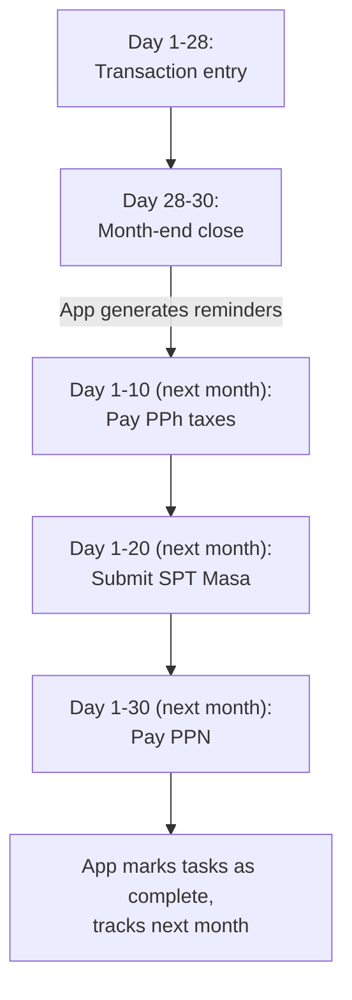

# Indonesian Tax Compliance

## Overview

Indonesian tax system for small businesses involves several types of taxes. This document outlines how the accounting application will handle Indonesian tax compliance requirements.

## Tax Types Coverage

### 1. PPN (Pajak Pertambahan Nilai) - Value Added Tax

**Applicability:**
- Only for PKP (Pengusaha Kena Pajak) - VAT registered businesses
- Current rate: 11% (as of 2022, was 10% before)
- Non-PKP businesses record gross amounts without PPN separation

**PPN Mechanism:**
- **PPN Keluaran (Output VAT):** Collected from customers when selling
- **PPN Masukan (Input VAT):** Paid to suppliers when purchasing
- **Net PPN Payable:** PPN Keluaran - PPN Masukan

**Chart of Accounts:**
```
1-1400  PPN Masukan (Asset - VAT Input)
2-1100  PPN Keluaran (Liability - VAT Output)
```

**Monthly Reporting:**
- SPT Masa PPN (Monthly VAT Return)
- Due: 20th of following month
- e-Faktur integration (future phase)

**Journal Template Examples:**

Sale with PPN (PKP):
```
Template: "Penjualan + PPN Keluaran"
Lines:
1. Debit  | Piutang/Kas          | 111% (DPP + PPN)
2. Credit | Pendapatan           | 100% (DPP)
3. Credit | PPN Keluaran         | 11%  (VAT)
```

Purchase with PPN (PKP):
```
Template: "Pembelian + PPN Masukan"
Lines:
1. Debit  | Beban/Aset           | 100% (DPP)
2. Debit  | PPN Masukan          | 11%  (VAT)
3. Credit | Kas/Hutang           | 111% (Total)
```

**Reports Needed:**
- PPN Calculation Summary
- SPT Masa PPN (Form 1111)
- Detailed sales with PPN Keluaran
- Detailed purchases with PPN Masukan

### 2. PPh 21 (Pajak Penghasilan Pasal 21) - Employee Income Tax

**Applicability:**
- Employers withholding tax from employee salaries
- Progressive rates based on income brackets

**Chart of Accounts:**
```
2-2100  Hutang PPh 21 (Liability - PPh 21 Payable)
5-3100  Beban Gaji (Expense - Salary)
```

**Journal Template:**
```
Template: "Bayar Gaji + PPh 21"
Lines:
1. Debit  | Beban Gaji           | gross_salary
2. Credit | Hutang PPh 21        | pph21_amount (calculated)
3. Credit | Kas/Bank             | net_salary (gross - pph21)
```

**Monthly Reporting:**
- SPT Masa PPh 21
- Due: 20th of following month
- e-Bupot integration (future)

**Calculation Notes:**
- Progressive rates: 5%, 15%, 25%, 30%
- PTKP (non-taxable income) adjustment
- Monthly vs annual calculation
- May be outsourced to payroll system (not core feature for MVP)

### 3. PPh 23 (Pajak Penghasilan Pasal 23) - Withholding Tax on Services

**Applicability:**
- Businesses receiving services must withhold 2% for most services
- Common for: consulting, rental, professional services

**Chart of Accounts:**
```
1-1500  Piutang PPh 23 (Asset - PPh 23 Receivable, if you're the service provider)
2-2200  Hutang PPh 23 (Liability - PPh 23 Payable, if you're the service recipient)
```

**Scenarios:**

**As service provider (receiving payment with PPh 23 withheld):**
```
Template: "Terima Pembayaran - Dipotong PPh 23"
Lines:
1. Debit  | Kas/Bank             | 98% (net received)
2. Debit  | Piutang PPh 23       | 2%  (withheld)
3. Credit | Piutang Usaha        | 100% (invoice amount)
```

**As service recipient (paying for services, withhold PPh 23):**
```
Template: "Bayar Jasa - Potong PPh 23"
Lines:
1. Debit  | Beban Jasa           | 100% (service cost)
2. Credit | Hutang PPh 23        | 2%   (to be remitted to tax office)
3. Credit | Kas/Bank             | 98%  (paid to vendor)
```

**Monthly Reporting:**
- SPT Masa PPh 23
- Due: 20th of following month
- Bukti Potong (withholding certificate) for vendors

### 4. PPh 4(2) - Final Income Tax

**Applicability:**
- Certain types of income subject to final tax
- Common: rental income, construction services
- Rates vary by type (e.g., 10% for rental)

**Chart of Accounts:**
```
1-1600  Piutang PPh 4(2) (Asset)
2-2300  Hutang PPh 4(2) (Liability)
```

**Example - Rental Income:**
```
Template: "Pendapatan Sewa - PPh Final 4(2)"
Lines:
1. Debit  | Kas/Bank             | 90%  (net received)
2. Debit  | Piutang PPh 4(2)     | 10%  (final tax)
3. Credit | Pendapatan Sewa      | 100% (gross income)
```

### 5. PPh 25 (Pajak Penghasilan Pasal 25) - Monthly Installment

**Applicability:**
- Monthly installment of annual corporate/personal income tax
- Based on previous year's tax liability
- For businesses with business income

**Chart of Accounts:**
```
2-2400  Hutang PPh 25 (Liability)
5-9100  Beban Pajak (Expense - Tax Expense)
```

**Journal Template:**
```
Template: "Bayar PPh 25"
Lines:
1. Debit  | Beban Pajak          | payment_amount
2. Credit | Kas/Bank             | payment_amount
```

**Notes:**
- Amount typically set at beginning of fiscal year
- Adjusted based on SPT Tahunan (annual return)
- May not apply to very small businesses

### 6. PPh Pasal 29 - Annual Tax Settlement

**Applicability:**
- Annual income tax final calculation
- Underpayment from PPh 25 installments
- Due with annual return (SPT Tahunan)

**Chart of Accounts:**
```
2-2500  Hutang PPh 29 (Liability)
5-9100  Beban Pajak (Expense)
```

## Tax Calendar & Reminders

### Monthly Deadlines
| Tax Type | Reporting Due | Payment Due | Form |
|----------|---------------|-------------|------|
| PPN | 20th of next month | End of next month | SPT Masa PPN (1111) |
| PPh 21 | 20th of next month | 10th of next month | SPT Masa PPh 21 |
| PPh 23 | 20th of next month | 10th of next month | SPT Masa PPh 23 |
| PPh 4(2) | 20th of next month | 10th of next month | SPT Masa PPh 4(2) |
| PPh 25 | 15th of next month | 15th of next month | SSP/e-Billing |

### Annual Deadlines
| Taxpayer Type | SPT Tahunan Due |
|---------------|-----------------|
| Personal (1770S/1770) | March 31 |
| Corporate (1771) | April 30 |

## Application Features for Tax Compliance

### Automatic Tax Calculation

**PPN Calculation (for PKP):**
```
When user enters transaction:
1. Select template: "Penjualan + PPN"
2. Enter DPP (base amount): Rp 1,000,000
3. System calculates:
   - PPN (11%): Rp 110,000
   - Total: Rp 1,110,000
4. Auto-creates journal entries with PPN Keluaran
```

**PPh 23 Calculation:**
```
When user enters service payment:
1. Select template: "Bayar Jasa - Potong PPh 23"
2. Enter service amount: Rp 10,000,000
3. System calculates:
   - PPh 23 withheld (2%): Rp 200,000
   - Net payment: Rp 9,800,000
4. Creates entries with Hutang PPh 23
```

### Tax Reports

**PPN Reports:**
1. **Daftar PPN Keluaran** (Output VAT List)
   - All sales transactions with PPN
   - Columns: Date, Customer, Faktur #, DPP, PPN, Total

2. **Daftar PPN Masukan** (Input VAT List)
   - All purchase transactions with PPN
   - Columns: Date, Supplier, Faktur #, DPP, PPN, Total

3. **Rekapitulasi PPN** (PPN Summary)
   - Total PPN Keluaran
   - Total PPN Masukan
   - Net PPN Payable / (Overpayment)

4. **SPT Masa PPN (Form 1111)** - Auto-generated from transactions

**PPh Reports:**
1. **Daftar Pemotongan PPh 23**
   - All PPh 23 withholdings
   - Grouped by vendor
   - Bukti Potong data

2. **Ringkasan PPh Terutang**
   - PPh 21, 23, 4(2), 25 summary
   - Payment status
   - Outstanding liabilities

3. **SPT Masa PPh 21/23** - Auto-generated

**Annual Tax Report:**
1. **Laba Rugi Fiskal** (Fiscal Income Statement)
   - Based on accounting P&L
   - With fiscal adjustments
   - Taxable income calculation

2. **SPT Tahunan 1770/1770S** (Personal) or **1771** (Corporate)
   - Pre-filled from transaction data
   - Requires manual adjustments

### Tax Compliance Workflow

**Monthly Routine:**


**Application Support:**
1. Calendar view with tax deadlines
2. Task checklist per month
3. One-click report generation
4. Export to PDF for filing
5. Track payment status

### Data Required for Tax Compliance

**Vendor/Customer Master Data:**
```
vendors/customers table:
- id
- tenant_id
- name
- npwp (15-digit tax ID)
- is_pkp (boolean)
- address
- tax_registration_date
```

**Faktur Pajak (Tax Invoice) Numbering:**
```
tax_invoices table:
- id
- tenant_id
- transaction_id
- faktur_number (format: 000.XXX-YY.XXXXXXXX)
- faktur_date
- customer_npwp
- dpp (base amount)
- ppn_amount
- status (draft, approved, cancelled, replaced)
- e_faktur_reference (future integration)
```

**Bukti Potong (Withholding Certificate):**
```
withholding_certificates table:
- id
- tenant_id
- transaction_id
- certificate_type (pph21, pph23, pph4_2)
- certificate_number
- recipient_npwp
- income_type
- gross_amount
- tax_rate
- tax_amount
- issue_date
```

## PKP vs Non-PKP Handling

### Non-PKP (Not VAT Registered)
- No PPN separation in transactions
- Templates without PPN lines
- Record gross amounts only
- Cannot claim PPN Masukan
- Simpler reporting

**Example Transaction:**
```
Template: "Pembelian (Non-PKP)"
Lines:
1. Debit  | Beban              | full_amount
2. Credit | Kas/Bank           | full_amount
```

### PKP (VAT Registered)
- Must separate DPP and PPN
- Issue Faktur Pajak for sales
- Collect input tax invoices for purchases
- Monthly PPN reporting
- e-Faktur compliance (future)

**Tenant Configuration:**
```
tenants table:
- is_pkp: boolean
  → Determines which templates are available
  → Enables/disables PPN features
  → Shows/hides PPN accounts
```

## Integration Points (Decision #28)

### Core Product: Export Format
- **e-Faktur:** Generate CSV export matching DJP e-Faktur import format
- **e-Bupot:** Generate export format for manual upload
- **e-Filing:** Export SPT data for manual entry or import
- Validate data before export (NPWP format, required fields)
- Track which transactions have been exported/reported

### Custom Project: PJAP Integration
Direct integration with authorized PJAP (Penyedia Jasa Aplikasi Perpajakan) providers is available as a custom project:
- OnlinePajak
- Klikpajak
- Other authorized PJAPs

**Scope:** Separate development, pricing, and invoicing per client request.

**Why Custom Project:**
- PJAP authorization required (not available to regular developers)
- Each client may prefer different PJAP provider
- Ongoing API maintenance as providers change
- Cost varies by PJAP provider

## Tax Account Structure

### Standard Indonesian Tax Accounts
```
Chart of Accounts - Tax Section:

ASSETS (Prepaid/Receivable Taxes)
1-1400  PPN Masukan
1-1500  Piutang PPh 23
1-1600  Piutang PPh 4(2)
1-1700  Piutang PPh 22

LIABILITIES (Tax Payables)
2-2100  Hutang PPh 21
2-2200  Hutang PPh 23
2-2300  Hutang PPh 4(2)
2-2400  Hutang PPh 25
2-2500  Hutang PPh 29
2-2600  PPN Keluaran

EXPENSES (Tax Expenses)
5-9100  Beban Pajak Penghasilan
5-9200  Beban Pajak Lainnya
```

## Validation Rules

### PPN Validation
- Only PKP tenants can use PPN templates
- PPN rate must be current rate (11% as of 2022)
- Faktur Pajak number format validation
- Customer/Vendor NPWP validation

### PPh Validation
- PPh 23 rate: 2% for most services (may vary)
- PPh 4(2) rate: varies by income type
- NPWP format: 15 digits (XX.XXX.XXX.X-XXX.XXX)
- Withholding only if recipient has NPWP

### Monthly Closing
- Cannot close month if tax liabilities unpaid (warning only)
- Remind to generate tax reports before closing
- Lock transactions after tax filing (configurable)

## User Guidance

### For Non-Accountants
- Simple language: "Pajak yang dipotong" not "PPh Pasal 23"
- Visual indicators: PKP badge, tax type icons
- Tooltips: "PPN 11% otomatis dihitung"
- Examples: Show sample filled forms

### For Junior Accountants
- Tax calculator tools
- Pre-filled templates
- Validation warnings
- Step-by-step filing guides

### Tax Deadline Dashboard
```
Upcoming Deadlines:
[ ] PPh 21 Payment     - Due: 10 Jan 2025 (3 days)
[ ] PPh 23 Payment     - Due: 10 Jan 2025 (3 days)
[ ] PPh 25 Payment     - Due: 15 Jan 2025 (8 days)
[ ] PPN Report         - Due: 20 Jan 2025 (13 days)
[ ] PPh Reports        - Due: 20 Jan 2025 (13 days)
```

## Phase Planning

### Phase 1 (MVP) - Updated per Decisions
- PPN basic tracking (Masukan/Keluaran)
- PPh 23 withholding
- **Full PPh 21 calculation** (Decision #15)
  - Progressive rates (5%-35%)
  - PTKP status handling
  - BPJS Kesehatan & Ketenagakerjaan
  - Payslip generation
- PPh 4(2) handling
- Basic tax reports
- **Export format for manual upload** (Decision #28):
  - e-Faktur CSV export
  - e-Bupot export format
  - SPT data export
- Tax calendar & reminders

### Phase 2+
- Automated SPT generation
- Advanced tax analysis

### Custom Project (upon request) - Decision #28
- Direct PJAP integration (OnlinePajak, Klikpajak)
- Automated e-Faktur submission
- Automated e-Bupot submission
- Separate development and invoicing per client

### NOT in Scope
- Direct DJP API integration (requires PJAP authorization)
- Real-time tax filing
