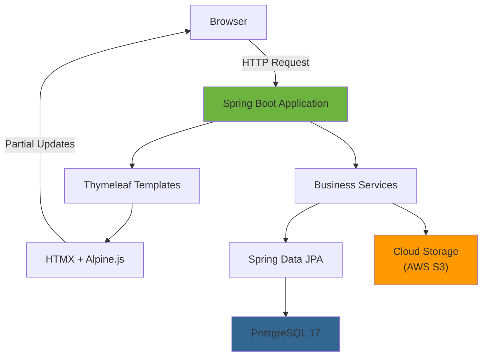
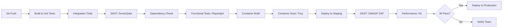
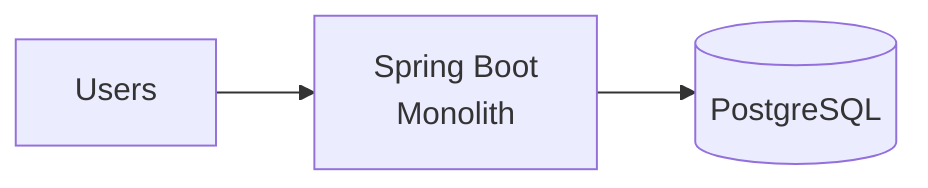
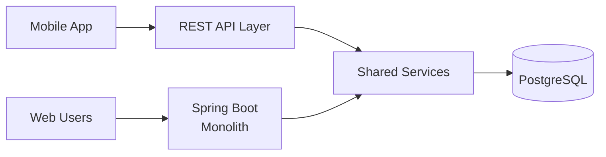
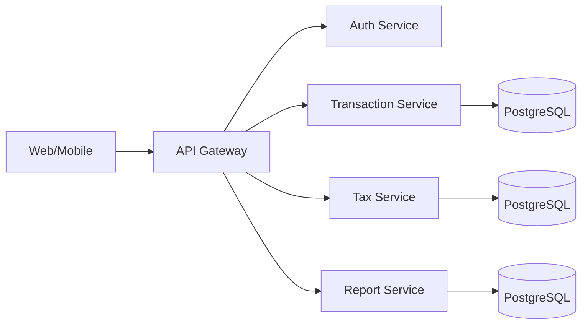

# Technology Stack

## Overview

This document outlines the technology stack selection for the accounting application, including alternatives considered and justification for final choices.

## Architecture Candidates Evaluated

### Option 1: Spring Boot + React/Vue (Split Backend/Frontend)

**Stack:**
- Backend: Spring Boot (REST API)
- Frontend: React/Vue/Svelte (SPA)
- Database: PostgreSQL

**Advantages:**
- Modern, responsive UI
- API-first design (mobile app ready)
- Separation of concerns
- Rich ecosystem for both stacks

**Disadvantages:**
- Two codebases to maintain
- Data model duplication (Java entities + TypeScript interfaces)
- Validation duplication (server + client)
- Complex authentication (JWT/BFF pattern required for SSO)
- API versioning overhead
- Higher development and debugging effort
- Network latency for every interaction
- CORS complexity

### Option 2: ExpressJS + Handlebars (Node.js Monolith)

**Stack:**
- Backend: ExpressJS
- Template: Handlebars
- Database: PostgreSQL

**Advantages:**
- Rapid prototyping
- Single language (JavaScript/TypeScript)
- Lightweight and fast startup
- Large npm ecosystem

**Disadvantages:**
- Floating-point issues for financial calculations (requires decimal.js)
- Weak typing without TypeScript enforcement
- Less structure for complex business logic
- Handlebars too limited for modern SaaS UX
- No compile-time safety for accounting rules

### Option 3: Spring Boot + Thymeleaf + HTMX (Modern Monolith) ✓

**Stack:**
- Backend: Spring Boot
- Template: Thymeleaf
- Interactivity: HTMX + Alpine.js
- Database: PostgreSQL

**Advantages:**
- Single codebase, single deployment
- No data model duplication
- No validation duplication
- Simple session-based authentication
- Precise financial calculations (BigDecimal)
- Type safety for business logic
- Partial page updates without SPA complexity
- Progressive enhancement (works without JavaScript)

**Disadvantages:**
- Server-rendered pages (not as flashy as SPA)
- HTMX learning curve
- Less separation of concerns than API approach

## Final Selection

### Core Stack

**Runtime:**
- Java 25 (LTS with virtual threads support)

**Backend Framework:**
- Spring Boot 4.0
- Spring Data JPA
- Spring Security
- Spring Validation

**Template Engine:**
- Thymeleaf

**Frontend Enhancement:**
- HTMX (partial page updates)
- Alpine.js (lightweight interactivity)
- Tailwind CSS or Bootstrap (styling)

**Database:**
- PostgreSQL 17

**Document Storage (Decision #19 & #27):**

*Dual implementation selectable by Spring profile/config:*

**1. Local Filesystem (MVP/development):**
- Profile: `storage.type=local`
- Store files in configurable directory
- Simple, zero external dependencies

**2. S3-Compatible Storage (Production/SaaS):**
- Profile: `storage.type=s3`
- Works with: MinIO (local), MinIO (VPS), AWS S3, GCP, Indonesian cloud
- Configure via: endpoint, bucket, access key, secret key

*Storage Features:*
- Image compression (80% quality on upload)
- Thumbnail generation for preview
- PDF optimization on upload
- ClamAV virus scanning on upload
- Max 10MB per upload
- Storage quota per instance (tier-based)

**Additional Tools:**
- Flyway (database migrations)
- iText or Apache PDFBox (PDF generation)
- Apache POI (Excel generation)

## Justification

### Why Monolith over Split BE/FE?

**Development Efficiency:**
- Single codebase reduces maintenance overhead
- No need to coordinate API contracts between teams
- Validation and business logic in one place
- Faster iteration and debugging

**Architectural Simplicity:**
- One deployment pipeline
- No CORS or API versioning issues
- Session-based auth simpler than JWT/OAuth flows
- No BFF pattern required for SSO

**Sufficient for Use Case:**
- Accounting software is form-heavy, not real-time collaborative
- Users don't expect SPA-level interactivity
- Desktop-primary usage (not mobile-first)
- HTMX provides modern UX without SPA complexity

**Cost Considerations:**
- Lower hosting costs (single application)
- Smaller team can maintain (no separate frontend specialists needed)
- Faster time to market

### Why Spring Boot over Node.js?

**Financial Precision:**
- BigDecimal for accurate money calculations
- No floating-point errors in tax computations
- Critical for accounting compliance

**Type Safety:**
- Compile-time validation of business rules
- Refactoring safety for complex journal template system
- IDE support catches errors early

**Transaction Management:**
- Mature ACID transaction handling
- Critical for double-entry bookkeeping integrity
- Rollback support for failed journal postings

**Instance Management:**
- Simple single-tenant architecture (one instance per company)
- No complex multi-tenancy code overhead
- Proven deployment patterns in Spring ecosystem

**Indonesian Market:**
- Java widely taught in Indonesian universities
- Large talent pool of Java developers
- Many Indonesian companies use Java/Spring (banks, fintech)

**Security:**
- Spring Security is battle-tested for financial applications
- Built-in CSRF, XSS protection
- OAuth2/JWT support if needed later

### Why HTMX over Pure Thymeleaf?

**User Experience:**
- Partial page updates feel modern (no full page reloads)
- Faster perceived performance
- Smoother workflows for repetitive tasks

**Progressive Enhancement:**
- Works without JavaScript (accessibility)
- Can enhance incrementally
- Fallback to full page reload if needed

**Simplicity:**
- No build process (unlike React/Vue)
- No state management complexity
- Declarative attributes in HTML
- Small learning curve

### Why PostgreSQL 17?

**Data Integrity:**
- ACID compliance critical for accounting
- Robust constraint enforcement
- Transaction isolation levels

**JSON Support:**
- Flexible metadata storage (transaction metadata, template formulas)
- Document structure for tax forms

**Performance:**
- Efficient indexing for common queries
- Materialized views for reports
- Partitioning support for large datasets

**Ecosystem:**
- Excellent Spring Data JPA support
- Well-documented
- Active community

**Cost:**
- Open source (no licensing fees)
- Cloud provider support (AWS RDS, Google Cloud SQL)

### Why Java 25?

**Virtual Threads:**
- Lightweight concurrency for handling concurrent requests
- Better resource utilization than traditional threads
- Ideal for I/O-heavy operations (database queries, file uploads)
- Efficient resource usage when co-locating multiple instances

**Long-Term Support:**
- LTS release with extended support timeline
- Production-ready stability
- Enterprise adoption

**Performance:**
- JVM optimizations for modern workloads
- Efficient garbage collection
- Lower memory footprint with modern GC algorithms

### Why Spring Boot 4.0?

**Modern Framework:**
- Expected release November 2025 (currently RC2)
- Full Java 21+ support with virtual threads integration
- Improved observability and metrics
- Production-ready for MVP timeline

**Enhanced Security:**
- Latest Spring Security updates
- OAuth2/OIDC improvements
- Better CSRF and XSS protections

**Performance:**
- Optimized for virtual threads
- Improved startup time
- Lower memory footprint

**Developer Experience:**
- Better error messages and diagnostics
- Enhanced auto-configuration
- Improved testing support

### Document Storage Strategy (Decision #19 & #27)

**Implemented Approach:**

*Dual Storage Backend (Selectable by Config):*

**Development/MVP:** Local Filesystem
- Zero dependencies
- Simple setup
- Profile: `storage.type=local`

**Production/SaaS:** S3-Compatible
- Profile: `storage.type=s3`
- Supports: MinIO, AWS S3, GCP, Indonesian cloud
- Single `DocumentStorageService` interface, swap implementation via config

*File Processing Pipeline:*
1. Upload received
2. ClamAV virus scan (reject if infected)
3. Image compression (80% quality)
4. Thumbnail generation
5. PDF optimization
6. Store to configured backend
7. Metadata saved to database (filename, path, size, mime type, upload date)

*Retention:*
- 10-year retention per Indonesian law (UU KUP, PMK 54/2021)
- Auto-generate berita acara (legalization record) for document digitization
- Digital documents legally valid per UU ITE and PMK 81/2024

## Development & Testing Tools

### Local Development

**Docker Compose:**
- Multi-container orchestration (app + PostgreSQL + MinIO)
- Consistent development environment across team
- Easy onboarding for new developers
- Service dependencies defined as code

**Hot Reload:**
- Spring Boot DevTools for rapid iteration
- LiveReload for frontend changes

### Infrastructure as Code & Deployment

**Phase 1: Manual + Docker Compose (Current)**
- Manual VPS provisioning (DigitalOcean, AWS)
- Docker Compose for container orchestration
- Simple bash scripts for common tasks
- Focus on product stability, not automation
- Target: Own company, 1-3 early customers

**Phase 2: Control Plane + Docker Compose**
- Build control plane application for client management
- Automated application deployment (Docker Compose API)
- Subdomain and Nginx configuration automation
- Client lifecycle management (onboarding, billing, monitoring)
- Infrastructure still manual (upgrade VPS as needed)
- Target: 5-50 clients on shared nodes

**Phase 3: Control Plane + Pulumi (Full Automation)**
- Programmatic VPS creation (DigitalOcean, AWS API)
- Infrastructure in TypeScript/Python/Java
- Type-safe, testable infrastructure code
- State management built-in
- Called from control plane app via Automation API
- Mix of dedicated and shared nodes
- Target: 50+ clients, premium tiers, geographic distribution

**Why Pulumi (Phase 3) over Ansible:**
- Better for creating cloud resources (VPS, DNS, storage)
- Real programming language (not YAML)
- Automation API for programmatic control
- Built-in state tracking
- Easier rollback and destruction
- Ansible better for configuring existing servers, Pulumi better for provisioning

### Testing Strategy

**Unit Testing:**
- JUnit 5 (testing framework)
- Mockito (mocking framework)
- AssertJ (fluent assertions)

**Integration Testing:**
- Testcontainers (real PostgreSQL in Docker)
- Spring Boot Test slices
- Database migration testing with Flyway

**Functional Testing:**
- Playwright
- Cross-browser testing (Chromium, Firefox, WebKit)
- Headless execution in CI/CD
- Screenshot on failure for debugging
- Test user workflows end-to-end

**Performance Testing:**
- K6 (load testing)
- Scripting in JavaScript
- Metrics: response time, throughput, error rate
- Test scenarios: normal load, peak load, stress testing
- Identify bottlenecks before production

### DevSecOps & Security Testing

**Static Application Security Testing (SAST):**
- SonarQube
  - Code quality and security vulnerabilities
  - Java security hotspots detection
  - Technical debt tracking
  - Integration with CI/CD pipeline

**Dependency Scanning:**
- OWASP Dependency-Check
  - Identify vulnerable dependencies
  - CVE database integration
  - Automated scanning in build pipeline
  - Fail build on high-severity vulnerabilities

- Snyk (alternative/complement)
  - Real-time vulnerability database
  - Fix suggestions with pull requests
  - Container image scanning

**Dynamic Application Security Testing (DAST):**
- OWASP ZAP (Zed Attack Proxy)
  - Automated security scanning
  - Active and passive scanning modes
  - API security testing
  - Integration with CI/CD

**Secret Scanning:**
- GitLeaks or TruffleHog
  - Prevent accidental secret commits
  - Scan git history for leaked credentials
  - Pre-commit hooks

**Container Security:**
- Trivy
  - Container image vulnerability scanning
  - Scan Docker images before deployment
  - OS package vulnerabilities
  - Fast and comprehensive

**Security Headers:**
- Spring Security default headers
- OWASP recommendations (CSP, HSTS, X-Frame-Options)
- Automated validation in tests

### CI/CD Pipeline

**Build & Test:**

**Why These Tools:**
- All open-source and actively maintained
- Large community support
- Well-documented
- Integration with popular CI/CD platforms (GitHub Actions, GitLab CI, Jenkins)
- Indonesian developer familiarity

## Migration Path

If requirements change, the monolith can evolve:

### Phase 1: Current (Monolith)

### Phase 2: Extract API (If Mobile App Needed)

### Phase 3: Microservices (If Scale Requires)

**Key Point:** Start simple, refactor when needed. Premature optimization wastes effort.

## Decision Summary

**Selected Stack:**

*Core Application:*
- Java 25 + Spring Boot 4.0 + Thymeleaf + HTMX + Alpine.js + PostgreSQL 17

*Document Storage (Decision #19 & #27):*
- Dual backend: Local FS (MVP) + S3-compatible (Production)
- Features: Compression, thumbnails, ClamAV scanning, 10MB limit

*Cloud Hosting (Decision #30):*
- Indonesian providers: IDCloudHost, Biznet Gio, Dewaweb
- Budget global: DigitalOcean
- Avoid AWS/GCP unless client requests

*Development & Testing:*
- Docker Compose (local development)
- Ansible (IaC and deployment)
- Playwright (functional testing)
- K6 (performance testing)
- SonarQube, OWASP Dependency-Check, ZAP, Trivy (DevSecOps)

*Formula Engine (Decision #13):*
- SpEL with SimpleEvaluationContext for journal template formulas
- Secure sandbox, no external dependencies

**Primary Reasons:**
1. Single codebase reduces complexity
2. Precise financial calculations with BigDecimal (Java 25)
3. Type safety for complex business logic
4. Simple authentication and deployment (Spring Boot 4.0)
5. Sufficient UX for accounting workflows (HTMX)
6. Large talent pool in Indonesia
7. Cost-optimized hosting (Indonesian providers or DigitalOcean)
8. Complete DevSecOps pipeline with open-source tools
9. Single-tenant architecture (no multi-tenancy complexity)
10. Virtual threads for efficient resource utilization (Java 25 + Spring Boot 4.0)
11. Can evolve to API architecture if needed

**Trade-offs Accepted:**
- Less flashy UI than SPA (acceptable for target users)
- Server-rendered pages (acceptable for form-heavy workflows)
- HTMX learning curve (small, worthwhile)
- Two storage implementations to maintain (offset by flexibility)

**Decision Date:** 2025-11-19 (Updated: 2025-11-22)

**Review Date:** After MVP launch (evaluate if mobile app or third-party API needed)
