# Architecture

System architecture and integration diagram for the accounting application.

## System Overview

```mermaid
flowchart TB
    subgraph Users["👤 USERS"]
        Browser["🖥️ Browser<br/>(Desktop)"]
        Mobile["📱 Mobile<br/>(Browser)"]
        Telegram["💬 Telegram<br/>App"]
    end

    subgraph DNS["🌐 DNS / CDN"]
        Domain["akunting.artivisi.id"]
    end

    subgraph VPS["🖥️ VPS SERVER"]
        subgraph Web["Nginx"]
            SSL["SSL Termination<br/>Let's Encrypt"]
        end

        subgraph App["Spring Boot Application"]
            Controllers["Controllers<br/>Web | API | Telegram | Report"]
            Services["Services<br/>Journal | Transaction | Report | Document | Tax"]
            JPA["JPA Repositories"]
        end

        subgraph DB["PostgreSQL"]
            Tables["Tables:<br/>users, chart_of_accounts,<br/>journal_entries, transactions,<br/>documents, projects"]
        end

        subgraph FS["File System"]
            AppJar["app.jar"]
            Documents["documents/"]
            Backup["backup/"]
        end
    end

    Browser --> Domain
    Mobile --> Domain
    Telegram --> Domain
    Domain --> SSL
    SSL --> Controllers
    Controllers --> Services
    Services --> JPA
    JPA --> Tables
    Services --> Documents
```

## External Integrations

```mermaid
flowchart LR
    subgraph VPS["VPS Application"]
        App["Spring Boot"]
        Backup["Backup Scripts"]
    end

    subgraph External["External Services"]
        TG["📱 Telegram API<br/>Bot & Webhook"]
        GCV["👁️ Google Cloud Vision<br/>OCR"]
        LE["🔒 Let's Encrypt<br/>SSL Certificates"]
    end

    subgraph Storage["Backup Destinations"]
        Local["💾 Local Disk<br/>Daily 02:00<br/>7 days"]
        B2["☁️ Backblaze B2<br/>Daily 03:00<br/>4 weeks<br/>Encrypted"]
        GD["📁 Google Drive<br/>Daily 04:00<br/>12 months<br/>Encrypted"]
    end

    App <--> TG
    App --> GCV
    LE --> App
    Backup --> Local
    Backup --> B2
    Backup --> GD
```

## Complete Integration Map

```mermaid
flowchart TB
    subgraph Users["Users"]
        U1["👤 Admin"]
        U2["👤 Accountant"]
        U3["📱 Telegram User"]
    end

    subgraph Internet["Internet"]
        DNS["🌐 DNS<br/>akunting.artivisi.id"]
        TG_API["Telegram API"]
    end

    subgraph VPS["VPS Server"]
        NGINX["🔒 Nginx<br/>Port 443"]

        subgraph SpringBoot["Spring Boot :10000"]
            WEB["Web Controller<br/>(Thymeleaf + HTMX)"]
            API["REST API"]
            TG_WH["Telegram Webhook<br/>/api/telegram/webhook"]
            DOC["Document Service"]
        end

        PG["🐘 PostgreSQL<br/>:5432"]
        FS["📁 File Storage<br/>/opt/.../documents/"]
        BK["📦 Backup<br/>/opt/.../backup/"]
    end

    subgraph Cloud["Cloud Services"]
        GCV["👁️ Google Cloud Vision<br/>(OCR)"]
        B2["☁️ Backblaze B2<br/>(Backup)"]
        GDRIVE["📁 Google Drive<br/>(Archive)"]
        LETS["🔐 Let's Encrypt<br/>(SSL)"]
    end

    U1 --> DNS
    U2 --> DNS
    U3 --> TG_API

    DNS --> NGINX
    TG_API --> TG_WH

    NGINX --> WEB
    NGINX --> API
    NGINX --> TG_WH

    WEB --> PG
    API --> PG
    TG_WH --> DOC
    DOC --> FS
    DOC --> GCV
    DOC --> PG

    BK --> B2
    BK --> GDRIVE
    LETS --> NGINX
```

## Data Flow: Web User

```mermaid
sequenceDiagram
    participant U as 👤 User
    participant N as 🔒 Nginx
    participant C as Controller
    participant S as Service
    participant R as Repository
    participant DB as 🐘 PostgreSQL
    participant T as Thymeleaf

    U->>N: HTTPS Request
    N->>C: Proxy (localhost:10000)
    C->>S: Process Request
    S->>R: Query Data
    R->>DB: SQL Query
    DB-->>R: Result Set
    R-->>S: Entity List
    S-->>C: DTO
    C->>T: Model + View
    T-->>C: HTML
    C-->>N: Response
    N-->>U: HTTPS Response
```

## Data Flow: Telegram Receipt Upload

```mermaid
sequenceDiagram
    participant U as 📱 User
    participant TG as Telegram API
    participant W as Webhook Controller
    participant D as Document Service
    participant V as 👁️ Vision API
    participant FS as 📁 File System
    participant DB as 🐘 PostgreSQL

    U->>TG: Send Photo
    TG->>W: POST /api/telegram/webhook
    W->>TG: Get File URL
    TG-->>W: File URL
    W->>D: Process Document
    D->>TG: Download Photo
    TG-->>D: Photo Bytes
    D->>FS: Save to /documents/
    D->>V: OCR Request
    V-->>D: Extracted Text
    D->>D: Parse Amount, Date, Vendor
    D->>DB: Save Document
    D->>TG: Send Reply
    TG-->>U: Confirmation Message
```

## Data Flow: Backup

```mermaid
sequenceDiagram
    participant CR as ⏰ Cron
    participant BS as backup.sh
    participant PG as 🐘 PostgreSQL
    participant FS as 📁 Files
    participant B2S as backup-b2.sh
    participant GDS as backup-gdrive.sh
    participant GPG as 🔐 GPG
    participant B2 as ☁️ B2
    participant GD as 📁 Google Drive

    Note over CR: Daily 02:00
    CR->>BS: Execute
    BS->>PG: pg_dump
    PG-->>BS: database.sql
    BS->>FS: tar + gzip
    FS-->>BS: backup.tar.gz
    BS->>BS: Cleanup old (>7 days)

    Note over CR: Daily 03:00
    CR->>B2S: Execute
    B2S->>GPG: Encrypt backup
    GPG-->>B2S: backup.tar.gz.gpg
    B2S->>B2: rclone copy
    B2S->>B2: Cleanup old (>4 weeks)

    Note over CR: Daily 04:00
    CR->>GDS: Execute
    GDS->>GPG: Encrypt backup
    GPG-->>GDS: backup.tar.gz.gpg
    GDS->>GD: rclone copy
    GDS->>GD: Cleanup old (>12 months)
```

## Security Architecture

```mermaid
flowchart TB
    subgraph Network["🌐 Network Layer"]
        FW["Firewall<br/>Ports: 22, 80, 443"]
        SSL["SSL/TLS<br/>Let's Encrypt"]
        NGINX["Nginx<br/>Reverse Proxy"]
    end

    subgraph Application["🔒 Application Layer"]
        AUTH["Spring Security<br/>bcrypt passwords"]
        SESS["Session<br/>HTTP-only cookies"]
        CSRF["CSRF Protection"]
        VALID["Input Validation"]
    end

    subgraph Database["🐘 Database Layer"]
        LOCAL["Localhost Only<br/>No remote access"]
        PGPASS[".pgpass<br/>mode 600"]
        ENCRYPT["Encrypted Backups<br/>GPG AES-256"]
    end

    subgraph Secrets["🔑 Secrets"]
        DBPASS["DB Password<br/>Ansible vault"]
        TOKENS["API Tokens<br/>Environment vars"]
        BKKEY["Backup Key<br/>.backup-key"]
        GCP["GCP Credentials<br/>gcp-credentials.json"]
    end

    FW --> SSL --> NGINX
    NGINX --> AUTH --> SESS --> CSRF --> VALID
    VALID --> LOCAL --> PGPASS --> ENCRYPT
```

## Deployment Architecture

```mermaid
flowchart LR
    subgraph Local["💻 Local Machine"]
        GIT["Git Repository"]
        MVN["./mvnw package"]
        JAR["target/*.jar"]
    end

    subgraph Infra["🏗️ Infrastructure"]
        PULUMI["Pulumi<br/>(Provision VPS)"]
        ANSIBLE["Ansible<br/>(Configure Server)"]
    end

    subgraph VPS["🖥️ VPS Server"]
        JAVA["Java 25"]
        PG["PostgreSQL 16"]
        NGX["Nginx + SSL"]
        SYS["systemd service"]
        CRON["Backup cron jobs"]
    end

    GIT --> MVN --> JAR
    JAR -->|scp| VPS
    PULUMI --> VPS
    ANSIBLE --> JAVA
    ANSIBLE --> PG
    ANSIBLE --> NGX
    ANSIBLE --> SYS
    ANSIBLE --> CRON
```

## Integration Summary

| Integration | Type | Purpose | Credentials |
|-------------|------|---------|-------------|
| **PostgreSQL** | Database | Data storage | DB user/password |
| **Telegram** | API | Receipt upload via chat | Bot token |
| **Google Cloud Vision** | API | OCR text extraction | Service account JSON |
| **Backblaze B2** | Storage | Offsite backup | Account ID + App Key |
| **Google Drive** | Storage | Archive backup | OAuth2 token |
| **Let's Encrypt** | SSL | HTTPS certificates | Email (for notifications) |

## Port Summary

| Port | Service | Access |
|------|---------|--------|
| 22 | SSH | Public (key-based) |
| 80 | HTTP | Public (redirects to 443) |
| 443 | HTTPS | Public |
| 5432 | PostgreSQL | localhost only |
| 10000 | Spring Boot | localhost only |

## Technology Stack

| Layer | Technology |
|-------|------------|
| Frontend | Thymeleaf + HTMX + Alpine.js |
| Backend | Spring Boot 3.4, Java 25 |
| Database | PostgreSQL 16 |
| Web Server | Nginx |
| SSL | Let's Encrypt (Certbot) |
| Process Manager | systemd |
| Backup | pg_dump, tar, GPG, rclone |
| Infrastructure | Pulumi (optional), Ansible |
