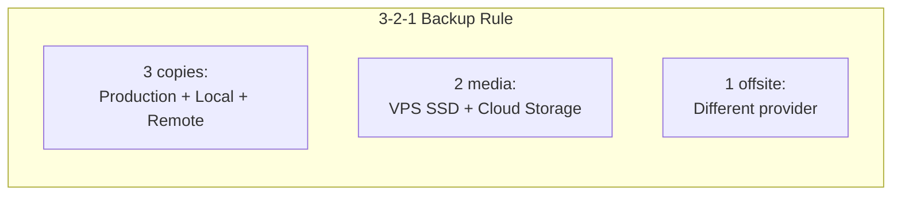
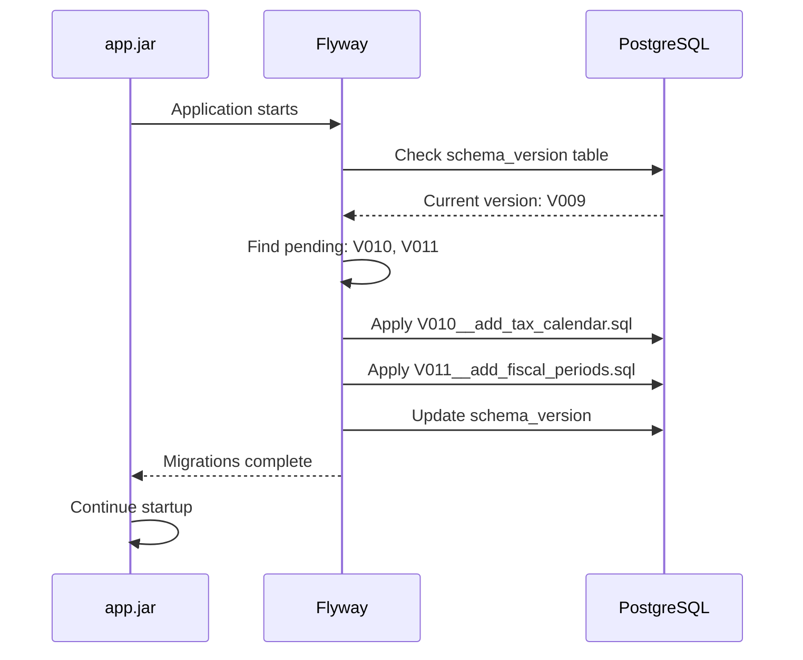
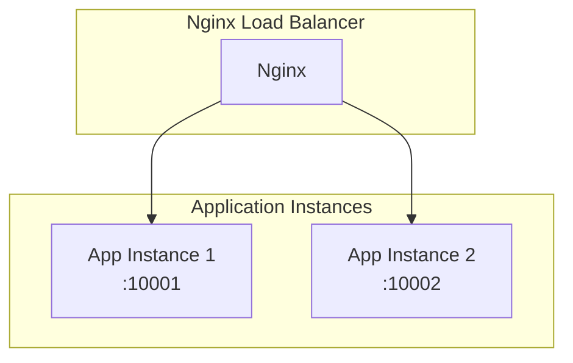

# Deployment Guide

Complete guide for deploying the accounting application to production using **Ansible automation**.

## 🚀 Quick Deployment Summary

The Ansible scripts provide **complete automated deployment** covering:
- ✅ **Server provisioning**: VPS setup, security hardening, dependencies
- ✅ **Application deployment**: JAR upload, service management, health checks
- ✅ **Integration setup**: Database, Nginx reverse proxy, SSL certificates
- ✅ **Automated backup**: Local + cloud backup with 3-2-1 strategy
- ✅ **Monitoring**: Logs, service status, SSL renewal

## 🎯 Two-Step Deployment Process

1. **Infrastructure Setup** (`site.yml`):
   - One-time server preparation
   - Creates all infrastructure components

2. **Application Deploy** (`deploy.yml`):
   - Deploys JAR file and configures admin user
   - Used for subsequent application updates

Both steps use Ansible automation - no manual server configuration required.

## Architecture Overview

```mermaid
flowchart TB
    subgraph VPS["🖥️ VPS Server"]
        subgraph NGINX["Nginx (Port 80, 443)"]
            SSL["Reverse Proxy + SSL Termination"]
        end

        subgraph APP["Spring Boot Application (Port 10000)"]
            TH["Thymeleaf + HTMX"]
            SVC["Services"]
            JPA["JPA"]
        end

        subgraph DB["PostgreSQL (Port 5432)"]
            DATA["Database"]
        end

        subgraph FS["File System"]
            FILES["/opt/accounting-finance/<br/>├── app.jar<br/>├── documents/<br/>├── backup/<br/>└── scripts/"]
        end
    end

    SSL --> APP
    TH --> SVC --> JPA --> DATA
    SVC --> FILES
```



## Prerequisites

### VPS Requirements

| Resource | Minimum | Recommended |
|----------|---------|-------------|
| OS | Ubuntu 22.04/24.04 LTS | Ubuntu 24.04 LTS |
| CPU | 1 vCPU | 2 vCPU |
| RAM | 2 GB | 4 GB |
| Disk | 20 GB SSD | 40 GB SSD |
| Network | 100 Mbps | 1 Gbps |

### DNS Configuration

Point your domain to the VPS IP:
```
akunting.artivisi.id  A  <VPS_IP_ADDRESS>
```

## Preparation Phase

Before starting deployment, gather all required credentials and make decisions.

### 1. Credentials Checklist

Prepare these credentials before starting:

| Credential | Where to Get | Example | Notes |
|------------|--------------|---------|-------|
| **VPS Provider Account** | IDCloudHost, Biznet, DigitalOcean | - | For provisioning server |
| **Domain Name** | Registrar (Niagahoster, etc) | akunting.artivisi.id | Point A record to VPS IP |
| **SSH Key** | `ssh-keygen -t ed25519` | ~/.ssh/id_ed25519.pub | For passwordless SSH |
| **Database Password** | Generate: `openssl rand -base64 24` | `K7xH2mN9pQ3wR5tY8uI0` | Strong, random |
| **Admin Username** | Your choice (NOT 'admin') | `johndoe` | Unique, non-guessable |
| **Admin Password** | Your choice | `MySecureP@ss123` | For web login |
| **SSL Email** | Your email | admin@artivisi.com | For Let's Encrypt notifications |
| **B2 Account ID** | Backblaze B2 Console | `0012345678abcdef` | Optional: for remote backup |
| **B2 Application Key** | Backblaze B2 Console | `K001xxxxxxxxxxxx` | Optional: for remote backup |
| **B2 Bucket Name** | Backblaze B2 Console | `artivisi-backup` | Optional: for remote backup |
| **Google Account** | Your Google account | - | Optional: for Google Drive backup |
| **Telegram Bot Token** | @BotFather | `123456:ABC-DEF...` | Optional: for receipt upload |
| **Telegram Chat ID** | @userinfobot | `123456789` | Optional: for deployment notifications |

### 2. Generate Passwords

Run these commands to generate secure random passwords:

```bash
# Database password (save this!)
echo "DB Password: $(openssl rand -base64 24)"

# Admin password (or use your own)
echo "Admin Password: $(openssl rand -base64 16)"

# Webhook secret (for Telegram, if needed)
echo "Webhook Secret: $(openssl rand -hex 32)"
```

### 3. Create Backblaze B2 Account (Optional)

If using B2 for remote backup:

1. Go to https://www.backblaze.com/b2/sign-up.html
2. Create account (free, no credit card required for first 10GB)
3. Create a bucket:
   - Name: `artivisi-backup` (or your choice)
   - Type: **Private**
   - Encryption: **Server-side (SSE-B2)**
4. Create Application Key:
   - Go to **App Keys** > **Add a New Application Key**
   - Name: `accounting-backup`
   - Bucket: select your bucket
   - Permissions: **Read and Write**
   - Save the **keyID** and **applicationKey** (shown only once!)

### 4. Prepare Google Drive (Optional)

If using Google Drive for backup:

1. Use a Google account (personal or Workspace)
2. You'll configure OAuth during `rclone config` on the server
3. Note: First-time setup requires a browser for OAuth flow

### 5. Provision VPS

Order a VPS with these specs (see `clients/artivisi/capacity-planning.md` for details):

| Spec | Minimum | Recommended |
|------|---------|-------------|
| OS | Ubuntu 22.04/24.04 LTS | Ubuntu 24.04 LTS |
| CPU | 1 vCPU | 2 vCPU |
| RAM | 2 GB | 4 GB |
| Disk | 20 GB SSD | 40 GB SSD |

After VPS is ready:
1. Note the **IP address**
2. Add your SSH key to the server
3. Test SSH access: `ssh root@YOUR_IP`

### 6. Configure DNS

Point your domain to the VPS:

```
akunting.artivisi.id  A  YOUR_VPS_IP
```

Wait for DNS propagation (check with `dig akunting.artivisi.id`).

### 7. Preparation Checklist

Before proceeding, verify you have:

- [ ] VPS running and accessible via SSH
- [ ] Domain pointing to VPS IP
- [ ] Database password generated and saved
- [ ] Admin password decided
- [ ] SSL email ready
- [ ] (Optional) B2 account ID and application key
- [ ] (Optional) Google account for Drive backup

## Quick Start (Copy-Paste Commands)

```bash
# 1. Clone repository (on local machine)
git clone https://github.com/artivisi/aplikasi-akunting.git
cd aplikasi-akunting

# 2. Build application
./mvnw clean package -DskipTests

# 3. Provision VPS (optional - if using Pulumi)
cd deploy/pulumi
npm install
pulumi up
cd ../..

# 4. Configure Ansible
cd deploy/ansible
cp group_vars/all.yml.example group_vars/all.yml
cp inventory.ini.example inventory.ini

# Edit group_vars/all.yml with your passwords and domain
# Edit inventory.ini with your server IP

# 5. Run Ansible for server setup
ansible-playbook -i inventory.ini site.yml

# 6. Configure Google Drive OAuth (ONLY if using Google Drive backup)
ssh root@YOUR_SERVER
sudo -u accounting rclone authorize "drive"
# Follow browser authentication flow and paste token back into group_vars/all.yml

# 7. Build and deploy application (includes automated verification)
./mvnw clean package -DskipTests
ansible-playbook -i inventory.ini deploy.yml
```

## Deployment Steps (Detailed)

### 1. Provision VPS (Pulumi)

```bash
cd deploy/pulumi
npm install
pulumi up
```

This creates the VPS on your configured cloud provider.

### 2. Configure Ansible Variables

```bash
cd deploy/ansible
cp group_vars/all.yml.example group_vars/all.yml
```

Edit `group_vars/all.yml`:

```yaml
# Application
app_name: accounting-finance
app_domain: akunting.artivisi.id

# Database (use strong passwords)
db_password: "<STRONG_PASSWORD>"

# Admin user (do NOT use 'admin' as username)
admin_username: "<UNIQUE_USERNAME>"
admin_password_plain: "<ADMIN_PASSWORD>"
admin_full_name: "Your Name"
admin_email: "your@email.com"

# SSL
ssl_enabled: true
ssl_email: "admin@artivisi.com"

# Backup
backup_cron_enabled: true
backup_cron_hour: "2"
backup_retention_count: 7
```

### 3. Configure Inventory

```bash
cp inventory.ini.example inventory.ini
```

Edit `inventory.ini`:
```ini
[app]
akunting.artivisi.id ansible_user=root
```

### 4. Run Ansible Server Setup

```bash
ansible-playbook -i inventory.ini site.yml
```

This installs and configures:
- Java 25
- PostgreSQL 16
- Nginx with SSL
- Application infrastructure (user, directories, systemd service)
- Backup scripts and cron jobs

### 5. Deploy Application

Build and deploy using Ansible:
```bash
./mvnw clean package -DskipTests
ansible-playbook -i inventory.ini deploy.yml
```

The `deploy.yml` playbook automatically:
- Builds and validates the JAR file
- Uploads JAR to server (`/opt/accounting-finance/app.jar`)
- Restarts the application service
- Creates/configures admin user with secure credentials
- Performs health check (HTTP 200 on /login)

### 6. Configure Google Drive OAuth (Only if using Google Drive backup)

**Important**: OAuth setup must happen after `site.yml` but before `deploy.yml` if using Google Drive backup.

```bash
# This step is ONLY needed if backup_gdrive_enabled: true in group_vars/all.yml
ssh root@akunting.artivisi.id

# Run OAuth authorization (rclone and infrastructure already set up by site.yml)
sudo -u accounting rclone authorize "drive"

# Follow browser authentication flow:
# 1. rclone will provide a URL
# 2. Open URL in browser and authorize Google Drive access
# 3. Copy the token back to the terminal
# 4. Edit group_vars/all.yml and add:
# backup_gdrive_token: '{"access_token":"...","refresh_token":"...","expiry":"..."}'
```

### 7. Deploy and Verify Complete System

Run the complete deployment with automated verification:

```bash
# Deploy application (includes comprehensive verification)
./mvnw clean package -DskipTests
ansible-playbook -i inventory.ini deploy.yml
```

**What gets verified automatically:**
- ✅ **Local backup**: Test backup runs successfully
- ✅ **B2 upload**: Encrypted backup uploaded to Backblaze (if enabled)
- ✅ **Google Drive**: Encrypted archive uploaded to Google Drive (if OAuth configured)
- ✅ **Telegram bot**: Bot token validation and test message (if enabled)
- ✅ **Google Cloud Vision**: OCR credentials validation (if enabled)
- ✅ **Encryption keys**: Backup encryption key generated and secured

**Deployment Order Summary:**
1. **`site.yml`** → Sets up infrastructure including rclone and backup scripts
2. **OAuth setup** → Only if using Google Drive (manual one-time step)
3. **`deploy.yml`** → Deploys app and runs verification tests

**Backblaze B2 requires no manual setup** - just configure credentials in `group_vars/all.yml`.

### 8. Import Initial Data

Import COA and journal templates:
```bash
# Via curl
curl -X POST https://akunting.artivisi.id/api/import/coa \
  -F "file=@clients/artivisi/templates/coa.json" \
  -u admin:YOUR_PASSWORD

curl -X POST https://akunting.artivisi.id/api/import/templates \
  -F "file=@clients/artivisi/templates/journal-templates.json" \
  -u admin:YOUR_PASSWORD
```

Or import via the web UI: **Pengaturan > Import Data**

## Post-Deployment Verification (Automatic)

**Ansible provides automated verification** during deployment. No manual verification needed - the playbook displays comprehensive status reports:

### Automated Verification Report

When `deploy.yml` completes, you'll see:

```
┌──────────────────────────────────────────────────────────────────┐
│ BACKUP VERIFICATION COMPLETE                                     │
├──────────────────────────────────────────────────────────────────┤
│ Local backup:    ✓ accounting-finance_20251129_020000.tar.gz  │
│ B2 upload:       ✓ Verified                                     │
│ Google Drive:    ✓ Verified                                     │
└──────────────────────────────────────────────────────────────────┘
```

And if enabled:

```
┌──────────────────────────────────────────────────────────────────┐
│ TELEGRAM VERIFICATION                                            │
├──────────────────────────────────────────────────────────────────┤
│ Bot token:       ✓ Valid (@YourBotUsername)                    │
│ Test message:    ✓ Sent to chat 123456789                      │
└──────────────────────────────────────────────────────────────────┘
```

### Optional Manual Verification (for debugging)

If you need to verify manually after deployment:

```bash
# Quick application health check
curl -f https://akunting.artivisi.id/login

# Check service status
ssh root@akunting.artivisi.id "systemctl status accounting-finance"

# Check recent backups
ssh root@akunting.artivisi.id "ls -la /opt/accounting-finance/backup/"
```

### Final Verification Checklist

| Check | Method | Expected |
|-------|--------|----------|
| App running | Browser: `https://YOUR_DOMAIN/login` | Login page loads |
| Admin login | Login with configured credentials | Dashboard appears |
| SSL valid | Browser padlock icon | No warnings |
| Backup automation | Check deployment output | ✅ All verification checks pass |

## Directory Structure

```
/opt/accounting-finance/
├── app.jar                    # Application JAR
├── application.properties     # Configuration
├── documents/                 # Uploaded files
│   └── receipts/
├── backup/                    # Backup archives
│   ├── accounting-finance_20251129_020000.tar.gz
│   └── ...
├── scripts/
│   ├── backup.sh              # Daily backup script
│   ├── backup-b2.sh           # Weekly B2 upload (if enabled)
│   ├── backup-gdrive.sh       # Monthly Google Drive archive (if enabled)
│   └── restore.sh             # Restore script
├── backup.conf                # Backup configuration (editable)
├── .backup-key                # Encryption key (save externally!)
└── .pgpass                    # PostgreSQL credentials

/var/log/accounting-finance/
├── app.log                    # Application logs
├── backup.log                 # Backup logs
└── restore.log                # Restore logs

/etc/nginx/sites-enabled/
└── accounting-finance.conf    # Nginx config

/etc/systemd/system/
└── accounting-finance.service # Systemd service
```

## Automated Backup

### Backup Schedule

| Type | Schedule | Retention | Location |
|------|----------|-----------|----------|
| Local | Daily 02:00 | 7 days | `/opt/accounting-finance/backup/` |
| B2 (offsite) | Daily 03:00 | 4 weeks | Backblaze B2 |
| Google Drive | Daily 04:00 | 12 months | Google Drive |

### What Gets Backed Up

1. **Database**: Full PostgreSQL dump (`database.sql`)
2. **Documents**: Compressed tarball (`documents.tar.gz`)
3. **Manifest**: JSON with checksums for verification

### Backup Archive Structure

```
accounting-finance_20251129_020000.tar.gz
└── accounting-finance_20251129_020000/
    ├── database.sql           # PostgreSQL dump
    ├── documents.tar.gz       # Uploaded documents
    └── manifest.json          # Checksums & metadata
```

### Manual Backup

```bash
sudo -u accounting /opt/accounting-finance/scripts/backup.sh
```

### Backup Verification

Check backup log:
```bash
tail -f /var/log/accounting-finance/backup.log
```

List backups:
```bash
ls -la /opt/accounting-finance/backup/
```

### Backup Strategy (3-2-1 Rule)

```mermaid
flowchart TB
    subgraph VPS["VPS Server"]
        PROD[("🐘 Production DB")]
        LOCAL["💾 Local Backup<br/>Daily 02:00<br/>7 days retention"]
    end

    subgraph Cloud["Cloud Storage (Offsite)"]
        B2["☁️ Backblaze B2<br/>Daily 03:00<br/>4 weeks retention"]
        GD["📁 Google Drive<br/>Daily 04:00<br/>12 months retention"]
    end

    PROD --> LOCAL
    LOCAL --> B2
    LOCAL --> GD
```





**Why dual remote backup:**
- Not dependent on single provider
- B2 for frequent restores (fast, cheap egress)
- Google Drive for long-term archive (free 15GB)
- If one provider fails, other still available

### Remote Backup Options

#### Option 1: Backblaze B2 (Primary Remote)

**Why B2:**
- Cost: ~$0.05/month for 10GB (first 10GB free)
- S3-compatible API
- No minimum commitment
- Free egress to Cloudflare partners

**Setup:**

1. Create B2 account and bucket:
   ```
   Bucket: artivisi-backup
   Type: Private
   Encryption: Server-side (SSE-B2)
   ```

2. Create Application Key with write access to bucket

3. Install rclone on server:
   ```bash
   sudo apt install rclone
   rclone config
   # Choose: backblaze b2
   # Enter: account ID and application key
   ```

4. Configure encrypted backup upload:
   ```bash
   # /opt/accounting-finance/scripts/backup-remote.sh
   #!/bin/bash
   BACKUP_FILE="$1"
   BUCKET="artivisi-backup"

   # Encrypt before upload (optional - B2 has server-side encryption)
   gpg --symmetric --cipher-algo AES256 \
       --passphrase-file /opt/accounting-finance/.backup-key \
       --batch --yes \
       -o "${BACKUP_FILE}.gpg" "${BACKUP_FILE}"

   # Upload to B2
   rclone copy "${BACKUP_FILE}.gpg" "b2:${BUCKET}/"

   # Cleanup local encrypted file
   rm "${BACKUP_FILE}.gpg"
   ```

5. Add to cron (after daily backup):
   ```bash
   # Weekly upload to B2 (Sunday 03:00)
   0 3 * * 0 /opt/accounting-finance/scripts/backup-remote.sh \
       $(ls -t /opt/accounting-finance/backup/*.tar.gz | head -1)
   ```

**Restore from B2:**
```bash
# List available backups
rclone ls b2:artivisi-backup/

# Download specific backup
rclone copy b2:artivisi-backup/accounting-finance_20251129_020000.tar.gz.gpg /tmp/

# Decrypt
gpg --decrypt --passphrase-file /opt/accounting-finance/.backup-key \
    -o /tmp/backup.tar.gz /tmp/accounting-finance_20251129_020000.tar.gz.gpg

# Restore
sudo /opt/accounting-finance/scripts/restore.sh /tmp/backup.tar.gz
```

**Monthly Cost Estimate:**
| Item | Cost |
|------|------|
| Storage (10GB) | Free (first 10GB) |
| Egress (restore) | ~$0.10 (rare) |
| **Total** | **~$0/month** |

#### Option 2: rsync to Separate VPS

For keeping backups within Indonesian infrastructure:

Enable in `group_vars/all.yml`:
```yaml
backup_remote_enabled: true
backup_remote_user: "backup"
backup_remote_host: "backup.example.com"
backup_remote_path: "/backups/accounting"
```

**Setup backup server:**
```bash
# On backup VPS (different provider than main)
useradd -m -s /bin/bash backup
mkdir -p /backups/accounting
chown backup:backup /backups/accounting

# Copy SSH key from main server
# On main server:
sudo -u accounting ssh-copy-id backup@backup.example.com
```

**Security:**
- GPG encrypt backups before transfer
- Use SSH key authentication (no passwords)
- Firewall: allow SSH only from main VPS IP

#### Option 3: Google Drive (Secondary/Archive)

Used as monthly archive backup alongside B2:

```bash
# Install and configure rclone for Google Drive
rclone config
# Choose: google drive
# Follow OAuth flow (requires browser for initial setup)
```

**Monthly archive script:**
```bash
# /opt/accounting-finance/scripts/backup-archive.sh
#!/bin/bash
BACKUP_FILE=$(ls -t /opt/accounting-finance/backup/*.tar.gz | head -1)
MONTH=$(date +%Y-%m)

# Encrypt
gpg --symmetric --cipher-algo AES256 \
    --passphrase-file /opt/accounting-finance/.backup-key \
    --batch --yes \
    -o "/tmp/archive-${MONTH}.tar.gz.gpg" "${BACKUP_FILE}"

# Upload to Google Drive
rclone copy "/tmp/archive-${MONTH}.tar.gz.gpg" "gdrive:accounting-backup/"

# Cleanup
rm "/tmp/archive-${MONTH}.tar.gz.gpg"

# Remove archives older than 12 months from Google Drive
rclone delete "gdrive:accounting-backup/" --min-age 365d
```

**Cron (1st of each month):**
```bash
0 4 1 * * /opt/accounting-finance/scripts/backup-archive.sh
```

**Limitations:**
- 15GB free (~12 years at current rate with monthly archives)
- OAuth token refresh needed if server reboots (rare)
- Slower than B2 for large restores

#### Combined Backup Schedule (Automated via Ansible)

All backup jobs are automatically configured by Ansible when you enable them in `group_vars/all.yml`:

```yaml
# group_vars/all.yml

# Daily local backup
backup_cron_enabled: true
backup_cron_hour: "2"
backup_retention_count: 7

# Weekly B2 backup
backup_b2_enabled: true
backup_b2_account_id: "your-account-id"
backup_b2_application_key: "your-app-key"
backup_b2_bucket: "artivisi-backup"
backup_b2_retention_weeks: 4

# Monthly Google Drive archive
backup_gdrive_enabled: true
backup_gdrive_token: '{"access_token":"...","refresh_token":"..."}'
backup_gdrive_folder: "accounting-backup"
backup_gdrive_retention_months: 12
```

Ansible deploys the following scripts and cron jobs:

| Script | Schedule | Purpose |
|--------|----------|---------|
| `backup.sh` | Daily 02:00 | Local DB + documents backup |
| `backup-b2.sh` | Daily 03:00 | Encrypted upload to B2 (offsite) |
| `backup-gdrive.sh` | Daily 04:00 | Encrypted upload to Google Drive (offsite) |

#### Backup Configuration File

All backup scripts read from `/opt/accounting-finance/backup.conf`. You can edit this file to change settings without re-running Ansible:

```bash
# View current config
cat /opt/accounting-finance/backup.conf

# Edit config
sudo nano /opt/accounting-finance/backup.conf
```

Example config:
```bash
# Backblaze B2
BACKUP_B2_ENABLED=true
BACKUP_B2_BUCKET="artivisi-backup"
BACKUP_B2_RETENTION_WEEKS=4

# Google Drive
BACKUP_GDRIVE_ENABLED=true
BACKUP_GDRIVE_FOLDER="accounting-backup"
BACKUP_GDRIVE_RETENTION_MONTHS=12
```

**Note:** Credentials are stored separately in `~/.config/rclone/rclone.conf`

### Backup Security Summary

| Layer | Implementation |
|-------|----------------|
| **In Transit** | SSH/TLS (rsync, rclone) |
| **At Rest (local)** | Linux file permissions |
| **At Rest (remote)** | GPG encryption + provider encryption |
| **Access Control** | SSH keys, API keys in secure files |

### Backup Encryption Key Management

The backup encryption uses GPG symmetric encryption with AES-256. A random passphrase is generated and stored on the server.

#### Key Generation

Ansible automatically generates the encryption key when B2 or Google Drive backup is enabled:

```bash
# Generated by Ansible (openssl rand -base64 32)
/opt/accounting-finance/.backup-key
```

The key is a 32-byte random string, base64 encoded. Example:
```
K7xH2mN9pQ3wR5tY8uI0oP4sD6fG1hJ2kL3zX5cV7bN=
```

#### ⚠️ CRITICAL: Save the Key Externally

**If the VPS is destroyed and you don't have the key, your encrypted backups are UNRECOVERABLE.**

After first deployment, immediately save the key:

```bash
# Display the key
sudo cat /opt/accounting-finance/.backup-key
```

**Store the key in at least TWO of these locations:**

| Location | How |
|----------|-----|
| Password Manager | Bitwarden, 1Password, KeePass - create entry "Accounting Backup Key" |
| Printed Copy | Print and store in physical safe/lockbox |
| Encrypted USB | Store on encrypted USB drive (VeraCrypt, LUKS) |
| Cryptomator Vault | Encrypted vault on cloud storage (Google Drive, Dropbox) - client-side encryption |

**DO NOT store the key in:**
- Same cloud provider as backups (if provider fails, both lost)
- Unencrypted email or messaging apps
- Plain text files on laptop
- Note-taking apps (Google Keep, Notion, Apple Notes) - plaintext, visible to shoulder surfing
- Cloud storage without encryption (Google Drive, Dropbox)

#### Manual Key Generation (if needed)

If you need to generate a new key manually:

```bash
# Generate new key
openssl rand -base64 32 > /opt/accounting-finance/.backup-key
chmod 600 /opt/accounting-finance/.backup-key
chown accounting:accounting /opt/accounting-finance/.backup-key
```

#### Key Rotation

To rotate the key (recommended annually):

1. Save the OLD key (you'll need it to decrypt old backups)
2. Generate new key
3. Re-encrypt any backups you want to keep with new key

```bash
# Save old key
OLD_KEY=$(cat /opt/accounting-finance/.backup-key)
echo "Old key (save this): $OLD_KEY"

# Generate new key
openssl rand -base64 32 > /opt/accounting-finance/.backup-key

# New backups will use new key
# Old backups still need old key to decrypt
```

#### Decryption Without Server Access

If the VPS is gone but you have:
1. The encrypted backup file (`.tar.gz.gpg`)
2. The encryption key

You can decrypt on any machine:

```bash
# Install gpg (if not installed)
# Ubuntu/Debian: apt install gnupg
# macOS: brew install gnupg

# Create key file
echo "YOUR_SAVED_KEY_HERE" > /tmp/backup-key

# Decrypt
gpg --decrypt --batch --passphrase-file /tmp/backup-key \
    -o backup.tar.gz \
    accounting-finance-archive-2025-01.tar.gz.gpg

# Extract
tar -xzf backup.tar.gz

# Clean up key file
rm /tmp/backup-key
```

#### Verification Checklist

After enabling remote backups, verify:

- [ ] Key file exists: `ls -la /opt/accounting-finance/.backup-key`
- [ ] Key saved to password manager
- [ ] Key saved to second location (printed/USB)
- [ ] Test decryption works with saved key
- [ ] Document who has access to the key

## Restore Procedure

### Prerequisites

1. Access to backup archive (`.tar.gz` file)
2. Root or sudo access to server
3. Application will be stopped during restore

### Restore Steps

#### 1. List Available Backups

```bash
ls -la /opt/accounting-finance/backup/
```

#### 2. Run Restore Script

```bash
sudo /opt/accounting-finance/scripts/restore.sh /opt/accounting-finance/backup/accounting-finance_20251129_020000.tar.gz
```

#### 3. Confirm Restore

The script will prompt for confirmation:
```
WARNING: This will restore the database and documents from backup.
         All current data will be REPLACED.

Backup file: /opt/accounting-finance/backup/accounting-finance_20251129_020000.tar.gz

Are you sure you want to continue? (yes/no): yes
```

#### 4. Restore Process

The script automatically:
1. Validates backup checksums
2. Stops the application
3. Drops and recreates database
4. Imports database dump
5. Restores documents (backs up current documents first)
6. Starts the application

### Restore Options

```bash
# Force restore (skip confirmation)
sudo /opt/accounting-finance/scripts/restore.sh --force backup.tar.gz

# Restore database only (skip documents)
sudo /opt/accounting-finance/scripts/restore.sh --db-only backup.tar.gz

# Restore from remote backup
scp backup@remote:/backups/accounting/backup.tar.gz /tmp/
sudo /opt/accounting-finance/scripts/restore.sh /tmp/backup.tar.gz
```

### Disaster Recovery

If the server is completely lost:

1. Provision new VPS with Pulumi
2. Run Ansible playbook
3. Copy backup file to new server
4. Run restore script

**RTO (Recovery Time Objective)**: ~4 hours
**RPO (Recovery Point Objective)**: 24 hours (last daily backup)

## SSL/TLS Management

### Option Comparison

| Feature | Let's Encrypt | Cloudflare |
|---------|---------------|------------|
| Cost | Free | Free |
| Setup Complexity | Low | Medium |
| Auto-renewal | Via certbot cron | Automatic |
| DDoS Protection | No | Yes |
| CDN/Caching | No | Yes |
| Traffic Routing | Direct to VPS | Via Cloudflare |
| Origin Exposed | Yes | No (proxied) |
| Indonesian DC | N/A | Singapore |

### Recommendation: Let's Encrypt

For Artivisi's use case, **Let's Encrypt** is recommended:

1. **Simpler setup** - Direct SSL termination at Nginx
2. **No third-party dependency** - Traffic goes directly to your server
3. **Privacy** - No middleman seeing your traffic
4. **Compliance** - Data doesn't leave your infrastructure
5. **Sufficient for scale** - <10 concurrent users doesn't need CDN

Use Cloudflare only if you need:
- DDoS protection (unlikely for internal business app)
- Global CDN (not needed for Indonesia-only users)
- IP masking (VPS IP hidden)

### Let's Encrypt Setup

Already configured in Ansible. The playbook:

1. Installs Certbot
2. Obtains certificate for your domain
3. Configures Nginx with SSL
4. Sets up auto-renewal cron

#### Manual Certificate Commands

```bash
# Check certificate status
sudo certbot certificates

# Test renewal
sudo certbot renew --dry-run

# Force renewal
sudo certbot renew --force-renewal

# Check expiry
echo | openssl s_client -servername akunting.artivisi.id -connect akunting.artivisi.id:443 2>/dev/null | openssl x509 -noout -dates
```

### Cloudflare Setup (Alternative)

If you choose Cloudflare:

1. Add domain to Cloudflare
2. Update nameservers at registrar
3. Enable "Full (strict)" SSL mode
4. Create Origin Certificate in Cloudflare
5. Install origin cert on server:

```bash
# /etc/nginx/ssl/cloudflare-origin.pem
# /etc/nginx/ssl/cloudflare-origin.key
```

Update nginx config to use Cloudflare certificates instead of Let's Encrypt.

## Service Management

### Application Service

```bash
# Status
sudo systemctl status accounting-finance

# Start/Stop/Restart
sudo systemctl start accounting-finance
sudo systemctl stop accounting-finance
sudo systemctl restart accounting-finance

# View logs
sudo journalctl -u accounting-finance -f

# View application logs
tail -f /var/log/accounting-finance/app.log
```

### Nginx

```bash
# Test config
sudo nginx -t

# Reload config
sudo systemctl reload nginx

# View access logs
tail -f /var/log/nginx/access.log
```

### PostgreSQL

```bash
# Status
sudo systemctl status postgresql

# Connect to database
sudo -u postgres psql -d accountingdb

# Check connections
sudo -u postgres psql -c "SELECT * FROM pg_stat_activity WHERE datname = 'accountingdb';"
```

## Monitoring Checklist

### Daily

- [ ] Check backup log for success
- [ ] Verify application is running

### Weekly

- [ ] Review application logs for errors
- [ ] Check disk usage
- [ ] Verify SSL certificate validity (>30 days)

### Monthly

- [ ] Test restore procedure (on staging)
- [ ] Review and rotate old backups
- [ ] Update system packages

## Troubleshooting

### Application Won't Start

```bash
# Check service status
sudo systemctl status accounting-finance

# Check Java process
ps aux | grep java

# Check port binding
sudo netstat -tlnp | grep 10000

# Check application logs
tail -100 /var/log/accounting-finance/app.log
```

### Database Connection Failed

```bash
# Check PostgreSQL status
sudo systemctl status postgresql

# Test connection
sudo -u postgres psql -d accountingdb -c "SELECT 1;"

# Check credentials in application.properties
grep -i "datasource" /opt/accounting-finance/application.properties
```

### SSL Certificate Expired

```bash
# Check current certificate
sudo certbot certificates

# Force renewal
sudo certbot renew --force-renewal

# Restart nginx
sudo systemctl restart nginx
```

### Backup Failed

```bash
# Check backup log
cat /var/log/accounting-finance/backup.log

# Check disk space
df -h

# Check PostgreSQL credentials
cat /opt/accounting-finance/.pgpass

# Run backup manually with debug
sudo -u accounting bash -x /opt/accounting-finance/scripts/backup.sh
```

## Subsequent Deployments (CI/CD)

After initial setup, use CI/CD for routine deployments.

### Deployment Workflow

```mermaid
flowchart LR
    subgraph Local["💻 Developer"]
        CODE["Code Changes"]
        PUSH["git push"]
    end

    subgraph GitHub["🐙 GitHub"]
        PR["Pull Request"]
        CI["GitHub Actions<br/>Build + Test"]
        MERGE["Merge to main"]
    end

    subgraph Server["🖥️ VPS"]
        PULL["Pull JAR"]
        FLYWAY["Flyway Migration"]
        RESTART["Restart Service"]
    end

    CODE --> PUSH --> PR --> CI
    CI -->|Pass| MERGE
    MERGE --> PULL --> FLYWAY --> RESTART
```



### Option 1: Ansible Deployment (Recommended)

**Use the built-in `deploy.yml` playbook for automated deployments:**

```bash
# Build application
./mvnw clean package -DskipTests

# Deploy using Ansible
ansible-playbook -i inventory.ini deploy.yml
```

**Advantages of Ansible deployment:**
- ✅ Automated JAR upload and service management
- ✅ Built-in health checks and rollback capability
- ✅ Secure admin user creation with bcrypt password hashing
- ✅ Validation of JAR file before deployment
- ✅ Proper service restart and startup monitoring
- ✅ Consistent deployment process across environments

**Manual Deploy Script (Alternative)**

For small teams that prefer manual scripts after testing locally.

**On your local machine**, create `deploy.sh`:

```bash
#!/bin/bash
set -e

# Configuration
SERVER="root@akunting.artivisi.id"
APP_NAME="accounting-finance"
APP_DIR="/opt/${APP_NAME}"

echo "=== Building application ==="
./mvnw clean package -DskipTests

JAR_FILE=$(ls target/*.jar | head -1)
echo "Built: ${JAR_FILE}"

echo "=== Uploading to server ==="
scp "${JAR_FILE}" "${SERVER}:${APP_DIR}/app.jar.new"

echo "=== Deploying on server ==="
ssh "${SERVER}" << 'EOF'
    set -e
    APP_DIR="/opt/accounting-finance"

    # Backup current JAR
    if [ -f "${APP_DIR}/app.jar" ]; then
        cp "${APP_DIR}/app.jar" "${APP_DIR}/app.jar.backup"
    fi

    # Replace with new JAR
    mv "${APP_DIR}/app.jar.new" "${APP_DIR}/app.jar"

    # Restart service (Flyway runs on startup)
    systemctl restart accounting-finance

    # Wait for startup
    echo "Waiting for application to start..."
    sleep 10

    # Health check
    HTTP_CODE=$(curl -s -o /dev/null -w "%{http_code}" http://localhost:10000/login)
    if [ "$HTTP_CODE" = "200" ]; then
        echo "✓ Deployment successful"
    else
        echo "✗ Health check failed (HTTP ${HTTP_CODE})"
        echo "Rolling back..."
        mv "${APP_DIR}/app.jar.backup" "${APP_DIR}/app.jar"
        systemctl restart accounting-finance
        exit 1
    fi
EOF

echo "=== Deployment complete ==="
```

**Usage:**

```bash
# Run tests locally first
./mvnw test

# Deploy to production
./deploy.sh
```

### Option 2: GitHub Actions CI/CD

Automated build and deployment on push to main branch.

**Create `.github/workflows/ci.yml`** (runs on every push):

```yaml
name: CI

on:
  push:
    branches: [main]
  pull_request:
    branches: [main]

env:
  JAVA_VERSION: '25'

jobs:
  build:
    runs-on: ubuntu-latest
    steps:
      - uses: actions/checkout@v4

      - name: Set up Java
        uses: actions/setup-java@v4
        with:
          java-version: ${{ env.JAVA_VERSION }}
          distribution: 'temurin'
          cache: 'maven'

      - name: Build with Maven
        run: ./mvnw clean package -DskipTests

  test:
    runs-on: ubuntu-latest
    steps:
      - uses: actions/checkout@v4

      - name: Set up Java
        uses: actions/setup-java@v4
        with:
          java-version: ${{ env.JAVA_VERSION }}
          distribution: 'temurin'
          cache: 'maven'

      - name: Run tests
        run: ./mvnw test
```

**Create `.github/workflows/deploy.yml`** (runs on release tags):

```yaml
name: Deploy Release

on:
  push:
    tags:
      - '[0-9][0-9][0-9][0-9].[0-9][0-9]-RELEASE'      # YYYY.MM-RELEASE (2025.11-RELEASE)
      - '[0-9][0-9][0-9][0-9].[0-9][0-9].[0-9]-RELEASE'  # YYYY.MM.patch-RELEASE (2025.11.1-RELEASE)
      - '[0-9][0-9][0-9][0-9].[0-9][0-9].[0-9][0-9]-RELEASE'  # YYYY.MM.patch-RELEASE (2025.11.10-RELEASE)
  workflow_dispatch:  # Manual trigger for hotfixes

env:
  JAVA_VERSION: '25'

jobs:
  build-and-test:
    runs-on: ubuntu-latest
    steps:
      - uses: actions/checkout@v4

      - name: Set up Java
        uses: actions/setup-java@v4
        with:
          java-version: ${{ env.JAVA_VERSION }}
          distribution: 'temurin'
          cache: 'maven'

      - name: Build and test
        run: ./mvnw clean package

      - name: Upload artifact
        uses: actions/upload-artifact@v4
        with:
          name: app-jar
          path: target/*.jar
          retention-days: 30

  deploy:
    needs: build-and-test
    runs-on: ubuntu-latest
    environment: production

    steps:
      - name: Download artifact
        uses: actions/download-artifact@v4
        with:
          name: app-jar

      - name: Deploy to server
        env:
          SSH_PRIVATE_KEY: ${{ secrets.SSH_PRIVATE_KEY }}
          SERVER_HOST: ${{ secrets.SERVER_HOST }}
          SERVER_USER: ${{ secrets.SERVER_USER }}
        run: |
          # Setup SSH
          mkdir -p ~/.ssh
          echo "$SSH_PRIVATE_KEY" > ~/.ssh/id_ed25519
          chmod 600 ~/.ssh/id_ed25519
          ssh-keyscan -H "$SERVER_HOST" >> ~/.ssh/known_hosts

          # Upload JAR
          JAR_FILE=$(ls *.jar | head -1)
          scp "$JAR_FILE" "${SERVER_USER}@${SERVER_HOST}:/opt/accounting-finance/app.jar.new"

          # Deploy
          ssh "${SERVER_USER}@${SERVER_HOST}" << 'DEPLOY'
            set -e
            APP_DIR="/opt/accounting-finance"

            # Backup and replace
            [ -f "${APP_DIR}/app.jar" ] && cp "${APP_DIR}/app.jar" "${APP_DIR}/app.jar.backup"
            mv "${APP_DIR}/app.jar.new" "${APP_DIR}/app.jar"

            # Restart
            systemctl restart accounting-finance
            sleep 10

            # Health check
            HTTP_CODE=$(curl -s -o /dev/null -w "%{http_code}" http://localhost:10000/login)
            if [ "$HTTP_CODE" != "200" ]; then
                echo "Rollback!"
                mv "${APP_DIR}/app.jar.backup" "${APP_DIR}/app.jar"
                systemctl restart accounting-finance
                exit 1
            fi
          DEPLOY

      - name: Create GitHub Release
        uses: softprops/action-gh-release@v1
        with:
          files: "*.jar"
          generate_release_notes: true
```

**Release workflow (CalVer):**

```bash
# 1. Ensure all tests pass
./mvnw test

# 2. Create and push release tag (CalVer: YYYY.MM-RELEASE or YYYY.MM.patch-RELEASE)
git tag 2025.11-RELEASE           # First release of November 2025
git push origin 2025.11-RELEASE

# For patch releases within same month:
git tag 2025.11.1-RELEASE         # First patch
git tag 2025.11.2-RELEASE         # Second patch

# 3. GitHub Actions automatically:
#    - Builds and tests
#    - Deploys to production
#    - Creates GitHub Release with JAR attached
```

**CalVer format:**

| Format | Example | Use Case |
|--------|---------|----------|
| `YYYY.MM-RELEASE` | `2025.11-RELEASE` | Monthly release |
| `YYYY.MM.patch-RELEASE` | `2025.11.1-RELEASE` | Hotfix/patch within month |

**Setup GitHub Secrets:**

| Secret | Value |
|--------|-------|
| `SSH_PRIVATE_KEY` | Content of SSH private key (ed25519) |
| `SERVER_HOST` | `akunting.artivisi.id` |
| `SERVER_USER` | `root` |

**Setup GitHub Environment:**

1. Go to **Settings > Environments > New environment**
2. Name: `production`
3. Add protection rules (optional):
   - Required reviewers
   - Wait timer

### Database Migrations

Flyway handles migrations automatically on application startup.



**Migration rules:**

1. **Never modify existing migrations** - Create new migration files only
2. **Test migrations locally** - Run against test database first
3. **Backward compatible changes** - New columns should be nullable or have defaults
4. **Large migrations** - Schedule during maintenance window

**Check migration status:**

```bash
# On server
sudo -u postgres psql -d accountingdb -c "SELECT * FROM flyway_schema_history ORDER BY installed_rank;"
```

### Rollback Procedure

If deployment fails:

```bash
# 1. SSH to server
ssh root@akunting.artivisi.id

# 2. Check if backup exists
ls -la /opt/accounting-finance/app.jar.backup

# 3. Rollback JAR
mv /opt/accounting-finance/app.jar.backup /opt/accounting-finance/app.jar
systemctl restart accounting-finance

# 4. Verify
curl -I http://localhost:10000/login
```

**Database rollback** (if needed):

```bash
# Restore from backup
sudo /opt/accounting-finance/scripts/restore.sh /opt/accounting-finance/backup/LATEST.tar.gz
```

### Zero-Downtime Deployment (Advanced)

For production systems requiring high availability:



**Steps:**

1. Deploy to instance 2 (while 1 handles traffic)
2. Health check instance 2
3. Switch traffic to instance 2
4. Deploy to instance 1
5. Enable both instances

**Note:** This adds complexity. Only use if downtime during restart (5-10 seconds) is unacceptable.

### Deployment Checklist

Before each deployment:

- [ ] Tests passing locally (`./mvnw test`)
- [ ] Code reviewed and merged to main
- [ ] Database migrations tested on dev/staging
- [ ] Backup exists (automatic daily, or manual before risky changes)

After deployment:

- [ ] Application responds to health check
- [ ] Login works
- [ ] Critical features functional
- [ ] No errors in logs (`tail /var/log/accounting-finance/app.log`)
